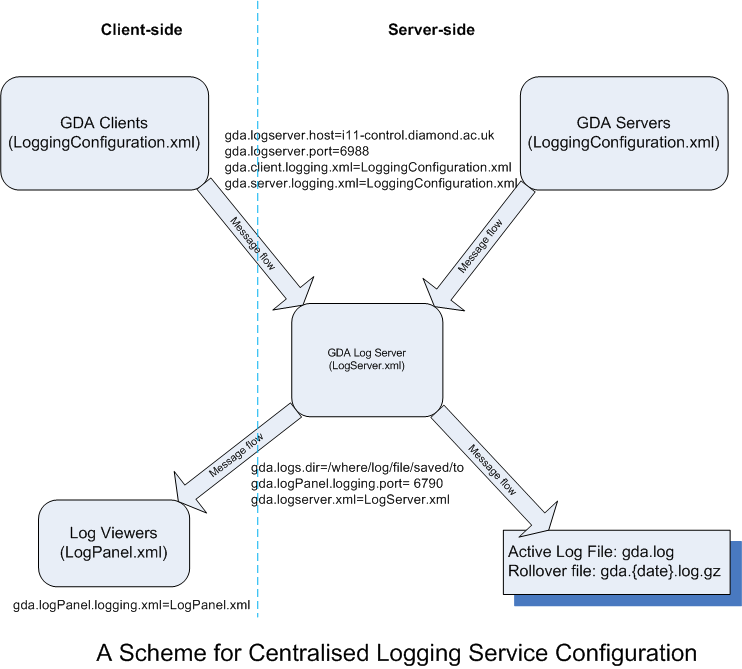

==================
 GDA configuration
==================

Spring configuration
====================

The ``gda`` namespace
---------------------

Using the namespace in your XML files
^^^^^^^^^^^^^^^^^^^^^^^^^^^^^^^^^^^^^

To use elements from the ``gda`` namespace, you will need to declare the namespace by adding the following attribute to
the ``<beans>`` element in your Spring configuration:

::

  xmlns:gda="http://www.diamond.ac.uk/schema/gda/gda"

You will also need to add these entries to the ``xsi:schemaLocation`` attribute:

::

  http://www.diamond.ac.uk/schema/gda/gda http://www.diamond.ac.uk/schema/gda/gda/gda-gda-1.0.xsd

Adding the namespace to your XML Catalog in Eclipse
^^^^^^^^^^^^^^^^^^^^^^^^^^^^^^^^^^^^^^^^^^^^^^^^^^^

If you use elements from the ``gda`` namespace in your XML files, you should add the schema for the ``gda`` namespace
to the Eclipse XML Catalog, so that Eclipse can validate XML files containing these custom elements. To do this:

- Open the Eclipse preferences (Window → Preferences)

- Go to XML → XML Catalog

- Click "Add..."

- Enter the following details:

  - Location: click "Workspace..." and select ``uk.ac.gda.core/src/gda/spring/namespaces/gda/gda-gda-1.0.xsd``

  - Key Type: choose "Namespace Name"

  - Key: enter ``http://www.diamond.ac.uk/schema/gda/gda/gda-gda-1.0.xsd``

``FindableNameSetterPostProcessor``
-----------------------------------

Putting this:

::

  <bean class="gda.spring.FindableNameSetterPostProcessor" />

in your Spring XML file causes all ``Findable`` objects to have their ``name`` property set to be the same as the Spring
``id``. Therefore you don't (except in a couple of special cases) need:

::

  <property name="name" value="..." />

Making properties from ``java.properties`` available
----------------------------------------------------

Use this:

::

  <context:property-placeholder location="file:${gda.config}/properties/java.properties" />

It allows you to use properties in your Spring XML files. For example:

::

  <property name="hostname" value="${gda.images.camerahost}" />
  
To make the tags in the ``context`` namespace are available to you, you will need to add the following attribute to
the ``<beans>`` element in your Spring configuration:

::

  xmlns:context="http://www.springframework.org/schema/context"

You will also need to add these entries to the ``xsi:schemaLocation`` attribute:

::

  http://www.springframework.org/schema/context http://www.springframework.org/schema/context/spring-context-2.5.xsd"

Instantiating EPICS devices directly
------------------------------------

For example:

::

  <bean id="S1_top_motor" class="gda.device.motor.EpicsMotor">
      <property name="pvName" value="BL04J-AL-SLITS-01:Y:PLUS" />
  </bean>

Instantiating using the EPICS interface "behind the scenes"
-----------------------------------------------------------

This is for those who don't like having PVs in their XML files ;-)

To use Diamond's GDA-EPICS interface file, generated during EPICS IOC build,

Put this somewhere in the Spring XML file (it doesn't need an ID):

::

  <bean class="gda.configuration.epics.EpicsConfiguration">
      <constructor-arg value="${gda.config}/xml/epics-interface.xml" />
  </bean>

Then do this:

::

  <bean id="S1_top_motor" class="gda.spring.EpicsMotorFactoryBean">
      <property name="deviceName" value="S1.YP" />
  </bean>

``EpicsMotorFactoryBean`` is a Spring `factory bean
<http://static.springsource.org/spring/docs/2.5.x/reference/beans.html#beans-factory-extension-factorybean>`_ - the
``S1_top_motor`` object will actually be an ``EpicsMotor``.

In addition to ``EpicsMotorFactoryBean``, there is also ``EpicsMonitorFactoryBean`` and ``EpicsPositionerFactoryBean``
(they all need a ``deviceName``).

Importing one file into another
-------------------------------

::

  <import resource="S1.xml" />

Effectively, the ``<import>`` is replaced with the contents of the imported file. All the beans are in the same Spring
*context* (i.e. no need to duplicate the ``PropertyPlaceholderConfigurer``, the ``FindableNameSetterPostProcessor``,
etc.).

Please use the ``ref`` attribute!!!
-----------------------------------

Instead of this:

::

  <bean id="s1_bottom" class="gda.device.scannable.ScannableMotor">
      <property name="motorName" value="S1_bottom_motor" />
  </bean>

you can do this:

::

  <bean id="s1_bottom" class="gda.device.scannable.ScannableMotor">
      <property name="motor" ref="S1_bottom_motor" />
  </bean>

Note the property is ``motor``, not ``motorName``, and this uses the ``ref`` attribute - which plugs the
``S1_bottom_motor`` motor into the ``s1_bottom`` object (so the ``ScannableMotor`` doesn't need to use the ``Finder`` to
get the underlying motor - it's already wired up using Spring).

Since Spring has this dependency injection capability, there's no need to use the ``Finder`` in new classes - Spring can
be used to do the wiring.

Making remote objects available through CORBA
---------------------------------------------

You'll need this in your server-side configuration:

::

  <corba:export namespace="stnBase" />

You need to declare the ``corba`` namespace by putting this at the top of the XML file:

::

  xmlns:corba="http://www.diamond.ac.uk/schema/gda/corba"

and adding these entries to the ``xsi:schemaLocation`` attribute:

::

  http://www.diamond.ac.uk/schema/gda/corba http://www.diamond.ac.uk/schema/gda/corba/gda-corba-1.0.xsd

Due to a limitation of Spring, property placeholders cannot be used in the ``namespace`` attribute when using
``<corba:export />``. So this, for example:

::

  <corba:export namespace="${gda.beamline.name}" />

will not work. (Property placeholders are typically resolved by a ``PropertyPlaceholderConfigurer``, which is a
``BeanFactoryPostProcessor`` that operates on bean definitions in an application context. The ``<corba:export />``
element itself is not transformed into a bean definition: it uses the namespace value to add bean definitions for remote
objects. It is not possible for the ``PropertyPlaceholderConfigurer`` to resolve placeholders used in the ``namespace``
attribute before that value is used to find remote objects.) 

Importing remote objects from another object server
---------------------------------------------------

You'll need this in your client-side configuration:

::

  <corba:import namespace="stnBase" />

As with ``<corba:export />``, to use the ``corba`` namespace you need to declare it at the top of the XML file.

The good thing about using ``corba:import`` is that 'hidden' beans are added to the Spring context for all of the remote
objects, so you can use them in any ``ref="..."`` attributes elsewhere in the file.

Enabling role-based access control using ``<gda:rbac />``
---------------------------------------------------------

To enable role-based access control (RBAC), add the following element to your Spring configuration:

::

  <gda:rbac />

You must also set the ``gda.accesscontrol.useAccessControl`` property to ``true``.

The ``corba`` namespace
-----------------------

As with the ``gda`` namespace, if you use the ``<corba:export>`` or ``<corba:import>`` elements described above, you
should add the schema for the ``corba`` namespace to the Eclipse XML Catalog. To do this, follow the instructions for
the ``gda`` namespace above, but use the following values:

  - Location: ``uk.ac.gda.core/src/gda/spring/namespaces/corba/gda-corba-1.0.xsd``

  - Key: ``http://www.diamond.ac.uk/schema/gda/corba/gda-corba-1.0.xsd``

Due to an issue with SpringSource Tool Suite, you may still get the following warning, which can be ignored:

    Unable to locate Spring NamespaceHandler for element 'corba:export' of
    schema namespace 'http://www.diamond.ac.uk/schema/gda/corba'

``SingletonRegistrationPostProcessor``
--------------------------------------

::

  <bean class="gda.spring.SingletonRegistrationPostProcessor" />

This registers certain objects you create in the Spring context as the application-wide singleton instances (e.g. the
metadata).

(Objects in Spring XML files are, by default, singletons. In a perfect world, the metadata and other singletons could be
injected into other objects, rather than the other objects calling ``Whatever.getInstance()``. In practice it's
difficult to do this because (1) there are too many objects that need the singletons; and (2) not all of those objects
will be defined in the Spring XML file. It's good to define the objects in the Spring XML file, as this gives us
complete control over their configuration, and means we can swap the real objects for mock objects. But this means we
need to register those objects with some kind of registry.)

Property editors
----------------

``PropertyEditor`` (`Javadoc <http://java.sun.com/javase/6/docs/api/java/beans/PropertyEditor.html>`_) is a standard
Java interface concerned with converting text representations of property values into their 'real' types (among other
things).

In Spring they are used to convert the text values used in Spring configuration files into the type required by the bean
being instantiated. Spring has built-in support for many types already, but by putting this in your Spring
configuration:

::

  <import resource="classpath:gda/spring/propertyeditors/registration.xml" />

you will also be able to set properties of these types:

- ``double[][]`` - 2D double array
- `org.apache.commons.math.linear.RealMatrix <http://commons.apache.org/math/api-2.0/org/apache/commons/math/linear/RealMatrix.html>`_ - Commons Math matrix 

and any other types supported by the ``PropertyEditor``\s listed in the ``GdaPropertyEditorRegistrar`` class.

Example Spring configuration
----------------------------

The Diamond I04.1 beamline uses Spring exclusively for its configuation. If you have access to the GDA Subversion
repository, you can `view the I04.1 configuration
<http://trac.diamond.ac.uk/gda/browser/trunk/configurations/diamond/i04-1>`_. The Spring contexts for the two object
servers are split into multiple XML files, which are all in the `servers/main/live
<http://trac.diamond.ac.uk/gda/browser/trunk/configurations/diamond/i04-1/servers/main/live>`_ directory.

Logging
=======

Logging messages can be generated not only by GDA classes, but also by third-party libraries such as `Apache Commons
Configuration <http://commons.apache.org/configuration/>`_. GDA classes typically use the `SLF4J <http://www.slf4j.org/>`_ API for logging. Log entries from code
that uses Commons Logging or Log4j are redirected into SLF4J using two `SLF4J bindings
<http://www.slf4j.org/legacy.html>`_: *Commons Logging over SLF4J* and *Log4j over SLF4J*.

GDA uses `Logback <http://logback.qos.ch/>`_ as the SLF4J implementation, so logging entries are passed from SLF4J to
Logback.

The following diagram shows one of the logging configuration options - the centralised logging service - used on some of DLS beamlines

Log Server configuration
------------------------

GDA provides an utility - ``gda.util.LogServer`` - for centrally logging messages from its objects running on both servers and clients as shown in the diagram above.
You need to configure the log server using four properties:

============================= ============
Property                      Description
============================= ============
``gda.logserver.port``        the port that the Log Server listening to
``gda.logserver.xml``         the logging configuration file, for example, LogServer,xml, of the log Server 
``gda.logs.dir``              the directory in which GDA log file, for example gda.log,  is to be stored
``gda.logPanel.logging.port`` the port that the log viewer listening to, i.e. the port the Log Server forwarding message to
============================= ============

While the first two properties is required by the LogServer class and are essential, 
the last two are optional and only used in the LogServer.xml file to specify the log destinations.

LogServer.xml defines logging destinations (appenders), logger level filters, and file logging rules for the cental logging service at the Log Server.

GDA objects logging configuration
---------------------------------

GDA objects are the sources of the logging messages in the system. Although it is possible to configure client objects logging differently from that of server objects, 
here we describe the situation that both client and server send their logging messages to the central Log Server as shown in the diagram above.

In this case, both clients and servers share the same logging configuration defined in, for example, LoggingConfiguration.xml or logBack.xml. 
Four properties (one is already defined above) need to be set:

========================== ============
Property                   Description
========================== ============
``gda.logserver.port``     the remote port to which all messages are sent, i.e.the Log Server's listening port
``gda.logserver.host``     the remote host in which the Log Server is running.
``gda.client.logging.xml`` the logging configuration file for GDA client objects
``gda.server.logging.xml`` the logging configuration file for GDA server objects
========================== ============
 
LoggingConfiguration.xml defines the Log Server as log destination and sets the desired logger level filters for all/specific loggers used in GDA objects at the message sources.

The reason that there are two logging configuration file properties in the system is historical as we used to configure clients differently from servers.
In the case we discussed here, the last two properties are pointed to the same LoggingConfiguration.xml file.

Log Viewer Configuration
------------------------

GDA also provides a simple log viewer utility - ``gda.util.LogPanel`` for viewing the logging messages received from the central Log server.
It connects to the Log server via a socket at port specified by property ``gda.logPanel.logging.port``. This property are required to start
the logPanel viewer.

============================= ============
Property                      Description
============================= ============
``gda.logPanel.logging.port`` the port that the log viewer listening to, i.e. the port the Log Server forwarding message to
``gda.logPanel.logging.xml``  the logging configuration file, for example, LogPanel.xml, for this log viewer.
============================= ============

LogPanel.xml provides you with opportunities to further configure your message display levels for all/specific loggers used in GDA objects at the display end.

Default server-side logging configuration
--------------------------------------------

The server-side logging configuration is used for object servers, and for the event server.

GDA has a default server-side logging configuration file, located in the ``uk.ac.gda.core`` plugin in the file
``src/gda/util/logging/configurations/server-default.xml``. It is currently used only to specify the log filters 
for some of the 3rd part libraries used in GDA.    

A server-side logging configuration file for a particular GDA configuration can be specified using the
``gda.server.logging.xml`` property. The default server-side configuration will be applied first,
followed by the custom configuration.

Default client-side logging configuration
--------------------------------------------

GDA has a default client-side logging configuration file, located in the ``uk.ac.gda.core`` plugin in the file
``src/gda/util/logging/configurations/client-default.xml``.It is currently used only to specify the log filters 
for some of the 3rd part libraries used in GDA.    

A client-side logging configuration file for a particular GDA configuration can be specified using the
``gda.client.logging.xml`` property. The default client-side configuration will be applied first,
followed by the custom configuration.

Using property placeholders in Logback configuration files
----------------------------------------------------------

You can make properties defined in ``java.properties`` available for use in a Logback configuration file by adding the
following element to the top of the file (inside the ``<configuration>`` element):

::

  <property file="${gda.config}/properties/java.properties" />

(Use of ``${gda.config}`` works here because ``gda.config`` is a system property.)

You can then use property placeholders elsewhere in the file. For example:

::

  <appender name="SOCKET" class="ch.qos.logback.classic.net.SocketAppender">
      <RemoteHost>${gda.logserver.host}</RemoteHost>
      <Port>${gda.logserver.port}</Port>
      ...
  </appender>

Note that the include statement available in properties file is not read by the logging system. To handle multiple properties files add 
multiple ``<property .../>`` elements.

Recording Jython terminal output
================================

The server can be configured to record all text sent to clients' Jython terminals to a file in the current data/visit
directory. To do this a RedirectablefileLogger should be created in Spring and provided an ObservablePathProvider which
tracks the data/visit directory. When the file location changes, a note will left in the last file directing a reader
to the new file, and a note will be made in the new file indicating where the log was transferred from. Adapters can then
be used to the same observables that a the JythonTerminal observes.

For example, given that a JythonServer has been made (always named
'command_server'), try this to get a JythonServerFacade reference::

   <bean id="jython_server_facade" class="gda.jython.JythonServerFacade">
       <constructor-arg ref="command_server" />
   </bean>

and then the following to build up a typical logger::

   <bean id="terminal_logger" class="gda.jython.logger.RedirectableFileLogger">
       <constructor-arg ref="terminallog_path_provider" />
   </bean>
   <bean class="gda.jython.logger.OutputTerminalAdapter">
       <constructor-arg ref="jython_server_facade" />
       <constructor-arg ref="terminal_logger"/>
   </bean>
   <bean class="gda.jython.logger.InputTerminalAdapter">
       <constructor-arg ref="command_server" />
       <constructor-arg ref="terminal_logger"/>
   </bean>
   <bean class="gda.jython.logger.ScanDataPointAdapter">
       <constructor-arg ref="jython_server_facade" />
       <constructor-arg ref="terminal_logger"/>
   </bean>
   <bean class="gda.jython.logger.BatonChangedAdapter">
       <constructor-arg ref="jython_server_facade" />
       <constructor-arg ref="terminal_logger"/>
   </bean>

where the terminallog_path_provider bean might be a dummy::

   <bean id="terminallog_path_provider" class="gda.data.SimpleObservablePathProvider">
       <property name="path" value="${gda.data.scan.datawriter.datadir}/gdaterminal.log" />
       <property name="local" value="true" />
   </bean>

or a one that tracks the server's visit metadata::

   <bean id="terminallog_path_provider" class="gda.data.ObservablePathConstructor">
       <property name="template" value="${gda.data.scan.datawriter.datadir}/gdaterminal.log" />
       <property name="gdaMetadata" ref="GDAMetadata" />
       <property name="local" value="true" />
   </bean>

Note: ``gda.data.ObservablePathConstructor`` does not support Java properties, only GDA-specific templates in implementation.
That is to say, it will not correctly interpret  aproperty such as ``${gda.data.scan.datawriter.datadir}``.
Instead, you have to put the value of this property in the Spring configuration above, e.g. ``/dls/i21/data/$year$/$visit$/spool/gdaterminal.log``. 

Note: the ``InputTerminalAdapter`` receives the commands typed into *all* clients' terminals
(via the command server).

Java Properties and Customising the GDA
=======================================

Properties to be shared throughout the code base are stored as name-value pairs in the ``java.properties`` file located in the ``config/properties`` folder. This is a common way to customise GDA behaviour.

Variable interpolation may be used when defining the java properties in the same manner as Spring or Logback xml files.

The following are the principal java properties which may need customising. However there are many more.

Java properties assumed to be set by -D flags when running the server processes: 

============== =======================
Property       Description
============== =======================
``gda.root``   the plugins directory of the GDA installation. The features and third-party directories are assumed to be at the same level
``gda.config`` location of the configuration directory. A standard sub-structure to this directory is assumed.
``gda.data``   the top-level data directory. The sub-directories where data files are actually written is derived by the ``gda.data.scan.datawriter.datadir`` property which should use variable interpolation
============== =======================

Note that the RCP client will also rely on the ``gda.config`` and ``gda.data`` variables being set in its ``.ini`` file.

Properties which must be set by a -D flag when running the GDA Java processes (third-party software requirement). These flags are added automatically by the Python start script: 

===================================== ===========
Property                              Description
===================================== ===========
``jacorb.config.dir``                 ``${gda.config}/properties`` or ``${gda.config}/jacorb/<mode>`` (new style configuration) or ``${gda.config}/properties/<mode>/jacorb`` (standard style configuration)- this is the directory containing the ``etc`` directory for JacORB
``gov.aps.jca.JCALibrary.properties`` The JCA library properties file for connecting to EPICS PVs.
===================================== ===========

Properties most likely to be customised: 

======================================= ===========
Property                                Description
======================================= ===========
``gda.logs.dir``                        global read-write directory for any logging processes. Note that the main logging system has its own configuration file as described above.
``gda.data.scan.datawriter.datadir``    the directory where data files are to be written. This can be made to be dynamic using the ``$visit$`` variable and configuring the ICAT system.
``gda.data.scan.datawriter.dataFormat`` the data format which scans write
``gda.rcp.workspace``                   where workspaces are created for the RCP client. This will need to use variable interpolation if multiple RCP clients are to be allowed. 
======================================= ===========

GDA property files are read using `Commons Configuration <http://commons.apache.org/configuration/>`_. More
information about the property file format can be found in the
`Properties files <http://commons.apache.org/configuration/userguide/howto_properties.html>`_ section of the
Commons Configuration `User's Guide <http://commons.apache.org/configuration/userguide/user_guide.html>`_.

A property file can include another property file by using the ``include`` directive. For more information,
see the `Includes <http://commons.apache.org/configuration/userguide/howto_properties.html#Includes>`_ section
in the User's Guide.

Metadata
========

ICAT
----

The ICAT subsystem talks to a database (an RDBMS or an xml file) which maps user id's to beamlines and experiments. It is used to find which experiments the user who started each client belongs to and so where any data should be written to by scans collected under the command of that client.

If no ICAT is used then data is always written to the same folder as defined by the gda.data.scan.datawriter.datadir java property.

Some examples of different ICAT systems:

To always write to the same data dir:

:: 

  gda.data                         = /scratch/data
  gda.data.scan.datawriter.datadir = ${gda.data}

For no ICAT, but to change the data directory in every different experiment:

::

  gda.data                         = /scratch/data
  gda.data.metadata.icat.type      = gda.data.metadata.icat.NullIcat
  gda.data.scan.datawriter.datadir = ${gda.data}/$visit$
  # change this for every experiment:
  gda.defVisit                     = myVisit
  

To use an ICAT to dynamically change the output directory depending on who is running the GDA client which has the baton (control of the beamline):

::

  gda.data                               = /scratch/data
  gda.data.scan.datawriter.datadir       = ${gda.data}/$year$/$visit$
  gda.data.metadata.icat.type            = gda.data.metadata.icat.DLSIcat
  gda.data.metadata.icat.url             = jdbc:oracle:thin:@(DESCRIPTION=(ADDRESS=(HOST=${oracle.host})(PROTOCOL=tcp)(PORT=${oracle.port}))(CONNECT_DATA=(SID=xe)))
  gda.data.metadata.icat.shift_tolerance = 1440
  gda.data.metadata.dlsicat.user         = icatusername
  gda.data.metadata.dlsicat.password     = icatpassword

The ``DLSIcat`` class provides connectivity to the ICAT database. There is an alternate class in the ``uk.ac.gda.core``
plugin called ``XMLIcat`` which uses an XML file as a database. This is primarily for use in unit testing or offsite
demonstrations, but could also be used by other facilities if they do a database dump into that format.

At Diamond, the scripts in ``/dls_sw/dasc/bin/iKittenScripts`` can be used to diagnose problems with ICAT. For example:

- ``getCurrentVisit`` will show the ID of the current visit, if there is one.
- ``getFedIdsForCurrentVisit`` will show details of users on the current visit.
- ``getDetailsOfVisit`` will show information about a particular visit.

Role-Based Access Control
=========================

Concepts
--------

The idea behind the RBAC system is not to provide cast-iron security to the system, but it to prevent users from accidentally operating hardware at the wrong time which could damage their experiment. E.g. preventing users from moving optical equipment which have been tuned or hardware shared between different branches

Device protection
^^^^^^^^^^^^^^^^^

Every piece of equipment (class extending Device) can be assigned a protection level (default is 1), and every user assigned an authorisation level (default is 1, but this can be configured to a different value). When certain methods of an object representing a device are called then the user's authorisation is compared to the protection level; if the authorisation is equal or greater than the protection level then the method is called, otherwise an gda.jython.accesscontrol.AccessDeniedException is thrown.

GDA developers do not have to write any special code in their device classes to implement this access logic. However if there is a method in a class or interface that needs protection (e.g. Motor.moveTo()) then in the Java source code you should annotate that method using the tag:

::

@!MethodAccessProtected(isProtected=true)

The RBAC system will search through the source code using reflection to find such annotations.

The idea is that certain methods will always check for protection whereas some will always be called no matter what the authorisation of the user (e.g. all users can ask the position of any motor, but may only be able to control certain motors).

Client authorisation
^^^^^^^^^^^^^^^^^^^^

When a GDA client is started the user id is either taken from the OS or a different user id and password maybe entered. If different details are entered they are authenticated against the whatever Authoriser has been configured (the single-sign-on LDAP system at Diamond).

The login in information is passed to the Command Server (Jython Server) from the client via the InterfaceProvider class. The client makes a unique registration with the Command Server so the source of each command may be identified. The Command Server then determines the authorisation level of that client by comparing the FedID that the Client uses against an xml database on that beamline. If the FedID is listed in the xml then the stored authorisation level is used, otherwise the client is given the default.

There is a tool (gda.jython.authoriser.EditPermissions) which developers or beamline scientists can use to set and change authorisation levels. It is recommended to only list users with elevated authorisation or beamline staff in the xml.

The Baton
^^^^^^^^^

One beamlines implementing the RBAC system there is the option to use a baton to determine which client has control of the beamline if the beamline may have multiple clients running. Clients holding the baton have control of the beamline subject to their authorisation level, whereas other clients cannot operate the protected methods of any hardware no matter what their authorisation level.

A baton holder may release the baton, so any client can pick it up or it can give the baton to a specific client.

A client may also take the baton from the baton holder if the holder has a lower authorisation level.

There is a GUI panel which lists all the clients on the beamline and has controls for releasing/taking/passing the baton.

Configuration options 
---------------------

java properties
^^^^^^^^^^^^^^^

To switch on rbac add the following element to your Spring configuration:

::

  <gda:rbac />

and set the following java property:

::

 gda.accesscontrol.useAccessControl = true

To switch on baton control (if this is set to true then you MUST use the BatonPanel in the Swing UI, it will be available by default in the SWT UI):

::

 gda.accesscontrol.useBatonControl = true

To set the default authorisation level (default is 1):

::

 gda.accesscontrol.defaultAuthorisationLevel = 1 

To set the default authorisation level for staff (default is 2):

::

 gda.accesscontrol.defaultStaffAuthorisationLevel = 2

For the first client after the server starts to automatically pick up the baton:

::

 gda.accesscontrol.firstClientTakesBaton = true

To tell the server which class to use for authorisation (This class must implement gda.jython.authoriser.gda.jython.authoriser, this is mainly to distinguish between users and staff):

::

 gda.gui.AcquisitionGUI.authorisationMethod = gda.jython.authoriser.LdapAuthoriser
 
A common implementation is the FileAuthoriser - in fact, the provided LDAPAuthoriser implementation uses a FileAuthoriser to provide a local override. FileAuthoriser uses an xml file, which it looks for in ${gda.user.permissions.dir} (or ${gda.config}/xml/ if the first property isn’t defined). Both have the same format, which is:

::

	<user_permissions>
		<user_id>N</user_id>
	</user_permissions>

Where user_id identifies a particular user, and N is the numeric permission level. Entries in the file user_permissions.xml indicate what users exist and their device permissions.

To tell the server which class to use for authentication (implements gda.jython.authenticator.Authenticator interface. If this is not defined then no login screen will appear and OS authentication will be used - this is recommended):

::

 gda.gui.AcquisitionGUI.authenticationMethod = gda.jython.authenticator.LdapAuthenticator

(for Diamond we now use ldap as the cclrc ldap server can also be used to distinguish staff and user accounts)

xml files
^^^^^^^^^

To identify specific accounts as staff there should be an xml file placed in the configuration which lists all staff (non-user) accounts which are outside of the ldap server.

This is xml/beamlinestaff.xml and a copy of this is in the example configuration.

The difference between staff and users in the RBAC system is that staff get a different default permission level and if no visit can be found in the ICAT system for that user ID then the default visit is used (defined by a java.property). If a non-staff account has no associated visit in the ICAT system then the UI will not start. 

xml tags
^^^^^^^^

On devices and DOFs in the Object server xml file:

::

 <protectionLevel>1</protectionLevel>

The protection level MUST be greater than 0!

In the client xml file (Swing UI only):

::

	<!BatonPanel>
	    <name>Baton Control</name>
	</BatonPanel>

How to setup RBAC on a beamline on Diamond
------------------------------------------

::

   1. set the java properties as listed above.
   2. add the appropriate tags to the server and client xml configuration files for each piece of hardware to control access to.
   3. add the beamlinestaff.xml file to your configuration to list which accounts should be treated as staff
   4. run the tool to build the authorisation database for that beamline if you wish to give certain users elevated permissions above the user default level: java -Dgda.root=/dls/ixx/software/gda -Dgda.config=/dls/ixx/software/gda/config -Dgda.propertiesFiles=/dls/ixx/software/gda/config/properties/java.properties gda.jython.authoriser.EditPermissions
   5. restart the GDA ! 

.. _new-configuration-layout-section:

New configuration layout
========================

Starting with GDA 8.10, a simplified startup mechanism is supported that allows two additional parameters to be
specified when using the ``gda`` launcher.

============= =============== =======
Parameter     Default setting Purpose
============= =============== =======
``--profile`` ``main``        Used to distinguish between different types of GDA object server or client
``--mode``    ``live``        Allows different variants of the configuration; for example, a 'live' mode that connects
                              to real hardware, or a 'dummy' mode where dummy devices are used
============= =============== =======

To allow these parameters to be used, a new directory layout must be used for the configuration. All of the following
directories must exist in the top level of the configuration directory:

============ =======
Directory    Purpose
============ =======
``clients``  Contains client-related XML configuration files
``jacorb``   Contains ``jacorb.properties`` files required by JacORB
``jca``      Contains ``JCALibrary.properties`` files required by JCA
``servers``  Contains server-related XML configuration files
============ =======

The following settings will then be automatically determined, and do not need to be specified when running the ``gda``
launcher:

============================== =====
Setting                        Value
============================== =====
Properties file                ``$CONFIG/properties/<mode>/java.properties``
JacORB configuration directory ``$CONFIG/jacorb/<mode>``
JCA configuration file         ``$CONFIG/properties/<mode>/JCALibrary.properties``
Server XML file                ``$CONFIG/servers/<profile>/<mode>/server.xml``
Client XML file                ``$CONFIG/clients/<profile>/<mode>/client.xml``
============================== =====

Notes on the new layout:

* The ``properties`` directory must contain a subdirectory for each mode (e.g. ``dummy`` and ``live``); each
  subdirectory must contain a ``java.properties`` file.
* The ``jacorb`` directory must contain a subdirectory for each mode; each subdirectory must contain the ``etc``
  directory required by JacORB (which in turn contains ``jacorb.properties``).
* The ``jca`` directory must contain a subdirectory for each mode; each subdirectory must contain a
  ``JCALibrary.properties`` file.
* The only files that must be present in the ``servers`` and ``clients`` subdirectories are
  ``<profile>/<mode>/server.xml`` and ``<profile>/<mode>/client.xml`` respectively. Other files can be placed at any
  level under ``servers`` and ``clients`` as required.

Object server startup file
--------------------------

Any client or server that starts up an object server or creates an objectServerImpl will create a startup file. The name 
of this file is different if the new configuration layout with profile name is used.
  
* ``<xmlfile>`` is the base name (without paths or suffix) of the XML file used to start the client or server
* ``<initialisationCompleteFolder>`` is defined in the Java property ``gda.objectserver.initialisationCompleteFolder`` that specifies where this file is to be created

================ ============================================================================
Layout format    Startup file name
================ ============================================================================
Old              ``<initialisationCompleteFolder>/object_server_startup_<xmlfile>``
New with profile ``<initialisationCompleteFolder>/object_server_startup_<xmlfile>_<profilename>``
================ ============================================================================

Memory configuration
====================

With recent versions of GDA, the default java memory options are becoming
insufficient for reliable operation of the RCP GDA client. While the
``gdaclient`` script in the ``example-config`` sets the starting and maximum
size of the general heap: 

::

    -Xms256m
    -Xmx1024m

it does not set the seperate starting or maximum *Permanent Generation* heap
sizes:

::

    -XX:PermSize=128m
    -XX:MaxPermSize=256m

Without at least a ``-XX:MaxPermSize`` option, an RCP GDA client which is more
complex than the example can quickly run out of *PermGen* space and crash,
leaving little evidence as to why it has crashed.

JVM Options
-----------

There are four main options which control the behaviour of the JVM garbage
collector:

=========================== =======
Parameter & Default setting Purpose
=========================== =======
``-XX:PermSize=16m``        Default starting size of the Permanent Generation heap.
``-XX:MaxPermSize=64m``     Default maximum size of the Permanent Generation heap.
``-Xms64m``                 Default starting size of the jvm heap.
``-Xmx1024m``               Default maximum size of the jvm heap.
=========================== =======

.. Note that rst Option Lists don't support long options prefixed with a single
   dash, only single character options prefixed with a single dash or slash,
   and long options prefixed with a double dash, hence using a table here. See: 
   http://docutils.sourceforge.net/docs/ref/rst/restructuredtext.html#option-lists

In addition, there are a few options which help to monitor the jvm garbage
collector and change it's behaviour.

==================================== =======
Parameter                            Purpose
==================================== =======
``-verbose:gc``                      Request that the jvm print details of each garbage collection.
``-XX:+PrintGCDetails``              Causes additional information to be printed.
``-XX:+PrintGCTimeStamps``           Will add a time stamp at the start of each collection
``-XX:+PrintHeapAtGC``               Prints even more information about each garbage collection.
``-XX:+DisableExplicitGC``           Request that the jvm ignore ``System.gc()`` calls.
``-XX:+ExplicitGCInvokesConcurrent`` Use a different GC mechanism for ``System.gc()`` calls.
==================================== =======

JVM defaults
------------

The current system defaults can be seen using the following command:
 
::

  $ java -server -XX:+PrintFlagsFinal -version 2>&1 | grep -i -E 'heapsize|permsize'
  uintx AdaptivePermSizeWeight               = 20               {product}
  uintx ErgoHeapSizeLimit                    = 0                {product}
  uintx InitialHeapSize                     := 66328512         {product}
  uintx LargePageHeapSizeThreshold           = 134217728        {product}
  uintx MaxHeapSize                         := 1063256064       {product}
  uintx MaxPermSize                          = 67108864         {pd product}
  uintx PermSize                             = 16777216         {pd product}

If we add in the suggested memory configuration options, we can see the effect
that these options have:

::

  $ java -server  -Xms256m -Xmx1024m -XX:PermSize=128m -XX:MaxPermSize=256m \
  >      -XX:+PrintFlagsFinal -version 2>&1 | grep -i -E 'heapsize|permsize'
  uintx AdaptivePermSizeWeight               = 20               {product}
  uintx ErgoHeapSizeLimit                    = 0                {product}
  uintx InitialHeapSize                     := 268435456        {product}
  uintx LargePageHeapSizeThreshold           = 134217728        {product}
  uintx MaxHeapSize                         := 1073741824       {product}
  uintx MaxPermSize                         := 268435456        {pd product}
  uintx PermSize                            := 134217728        {pd product}

Note: If the above commands show no output, or reduced output, try adding the
parameter:

::

  -XX:+UnlockDiagnosticVMOptions

Optimising starting and maximum values
--------------------------------------

The JVM allows you to specify different starting and maximum values so that you
can optimise memory use in your application.

The options ``-Xms256m -Xmx1024m`` say:

* Start by allocating 256MB of memory to the heap for this application, but
  allow the heap to grow up to 1GB if the application requires it.

If the memory required by the application increases above 256MB, then the JVM
will request more memory from the operating system and resize the application
heap. If the memory required by the application increases above 1GB, then then
eventually the application will crash with a ``java.lang.OutOfMemoryError``
exception. 

Unfortunately every time the JVM increases the size of the heap, time is
required to manage the expansion. If a GDA client allocates 400MB of memory
during the process of starting up, it will start with 256MB, increase it by
a small block when it goes above that, increase it a little more when it goes
over that new limit and and keep increasing the size until it no longer need
to increase the heap any more. Each of these heap expansions will add time to
the start up of the GDA client.

For optimal results, it is a good idea to use ``jvisualvm`` to profile how much
memory the GDA client typically needs, then add a little more for future
expansion.

For instance, if a client allocates 400MB just for startup, rises to 480MB after
a few basic scans, but rises to 1.6GB during intense use, then ``-Xms512m
-Xmx2g`` might be a good starting point.

The same applies to *Permanent Generation* space. 

For instance, if ``jvisualvm`` shows you that a client allocates uses 60MB when
starting up with the scan perspective, rises to 90MB after opening the PyDev
scripts perspective and peaks at 150MB during a long session, then the 
``--XX:PermSize=96m -XX:MaxPermSize=192m`` might be sufficient.

Out of memory exceptions
------------------------

Most out of memory exceptions are a simple matter of the jvm running out of
general heap space, which can often be corrected by increasing the ``-Xmx``
value.

When you run out of heap space, the error will be of the form:

::

  java.lang.OutOfMemoryError: Java heap space

Other out of memory exceptions are more obscure though.

In java 6, the garbage collector will generate an out of memory exception *if
more than 98% of the total time is spent in garbage collection and less than 2%
of the heap is recovered*. This may indicate that you are creating an excessive
number of temporary objects in an already memory constrained jvm. It might be
fixed by just giving the jvm more heap space, but it may also be indicative of
other problems.

When garbage collection was taking over your application, the error will be of
the form:

::

  java.lang.OutOfMemoryError: GC overhead limit exceeded 

When you run out of *PermGen* space, the error may occur in a random thread,
so any error of the form:

::

  java.lang.OutOfMemoryError: PermGen space

is an indication that ``-XX:MaxPermSize=`` may need to be increased.

An example of an error due to MaxPermSize being too low, logged in a
``gda_output`` log file was:

::

  Logging exception:
  java.lang.OutOfMemoryError: PermGen space
  Exception in thread "jReality ToolSystem EventQueue" java.lang.OutOfMemoryError: PermGen space
  Exception in thread "AWT-EventQueue-0" java.lang.OutOfMemoryError: PermGen space

Finally, on 32-bit RHEL machines, there also appears to be an issue when
you increase the total of permgen space and heap to around 2.6GB.

In one test, using ``-Xmx2048m -XX:MaxPermSize=768m``, the jvm refuses to load
the client. This can be shown with:

::

  $ java -Xmx2048m -XX:MaxPermSize=768m -version
  Error occurred during initialization of VM
  Could not reserve enough space for object heap
  Could not create the Java virtual machine.

With ``-Xmx2048m -XX:MaxPermSize=640m``, the jvm allows the RCP GDA client to
load, but then within 300 to 1000 seconds, the client would crash with a fatal
error in the java runtime:

::

  # A fatal error has been detected by the Java Runtime Environment:
  #
  # java.lang.OutOfMemoryError: requested 32756 bytes for ChunkPool::allocate. Out of swap space?
  #
  #  Internal Error (allocation.cpp:166), pid=6265, tid=69073808
  #  Error: ChunkPool::allocate
  #
  # JRE version: 6.0_24-b07
  # Java VM: Java HotSpot(TM) Client VM (19.1-b02 mixed mode linux-x86 )
  # An error report file with more information is saved as:
  # /home/gfn74536/hs_err_pid6265.log

This is an internal error, not an exception, so it cannot be caught or handled,
and appears to be the jit compiler itself running out of memory, even though
there is plenty of both heap and PermGen space available.  

The limits of the Windows 32bit jvm and the Windows or Linux 64bit jvm's have
not been explored.

Pauses due to garbage collection
--------------------------------

If your GDA client suffers from frequent noticable pauses, you may want to try
adding the option:

::

  -verbose:gc

This will log details of the heap before and after each garbage collection,
along with the time that the collection took. Since the JVM performs both
*minor* and *full* collections, some will take very little time to complete 
while others may take seconds to complete.

Further options can be used to provide more information at each garbage
collection.

::

  -XX:+PrintGCDetails
  -XX:+PrintGCTimeStamps
  -XX:+PrintHeapAtGC

Although use of the ``System.gc()`` call is discouraged, some parts of the GDA
software still use it. As ``System.gc()`` forces an immediate explicit full
garbage collection, each call could cause the RCP GDA client to pause for more
than a second.

If explicit garbage collection is causing problems, you can instruct the jvm to
ignore calls to ``System.gc()`` by the use of the option:

::

  -XX:DisableExplicitGC

Another option [#]_ , which was introduced in Java 6, appears to offer halfway
house between full explicit garbage collection and none:

::

  -XX:+ExplicitGCInvokesConcurrent

.. [#] http://java.sun.com/performance/reference/whitepapers/6_performance.html#2.2.2

This option uses the *Concurrent Mark Sweep Collector* which aims to keep
garbage collection-induced pauses short. This has not be tested, but might be
worth investigating if both disabling explicit garbage collections and leaving
it enabled cause problems. 

Further information
-------------------

For Java 6 the official tuning guide can be found in the document
*Java SE 6 HotSpot[tm] Virtual Machine Garbage Collection Tuning* [#]_ and 
there is additional information in the *Java SE 6 Performance White Paper*. [#]_

.. [#] http://www.oracle.com/technetwork/java/javase/gc-tuning-6-140523.html
.. [#] http://java.sun.com/performance/reference/whitepapers/6_performance.html
