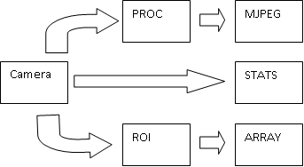

=========================================
 EPICS AreaDetector Viewer
=========================================

.. image:: images/epics_logo.png

`EPICS <http://www.aps.anl.gov/epics/>`_

The EPICS AreaDetector system is used widely within Diamond for both diagnostic cameras and experimental 
xray detectors. GDA plugin ``uk.ac.gda.epics.adviewer`` provides code for visualising such systems within an RCP GUI.

The ADViewer provides 3 views:

* **MJPegView** - for display of the stream from the MJPeg plugin,
   .. image:: images/I13PCOLiveView.png
* **HistogramView** - for display of the data from the stats plugin,
   .. image:: images/PCOHistogramView.png
* **TwoDArrayView** - for display of the contents of the Array plugin PV as a 2d image
   .. image:: images/PCOArrayView.png

As the image from the MJPeg view is normally an 8 bit representation of the camera image it is usual to use the
PROC plugin to select the range of values in the camera image that are to be presented by the 8bit scale. 

The range consists of 2 numbers:

* (a) the value in the image that is to be represented as 0
* (b) the value in the image that is to be represented as 255.

All other values are scaled appropriately. 

Values for (a) and (b) can be controlled by the user from a display of the histogram of the camera image or automatically 
from the same data. In automatic mode the values of (a) and (b) are chosen to be  the 5% and 95% percentile values.

In the case of large detector images simply pulling the data from the Array plugin of the IOC can be slow. 
In such cases the user may prefer to select a region of interest of the camera image instead. ADViewer makes 
this simple by automatically enabling a ROI plugin.

EPICS AreaDetector plugins work independent of each other and can be configured together at runtime. The ADViewer assumes a certain
set of plugins to exist and to be connected in a certain way. This is shown below

How to Add ADViewer views to a GUI when the plugins conform to the DLS AreaDetector Plugin Standard
---------------------------------------------------------------------------------------------------

If the PV's for the EPICS Area Detector plugins accessed by the ADViewer views follow the convention::

	ADBase PV = <Prefix>CAM:*
	Array Plugin PV = <Prefix>ARR:*
	ROI Plugin PV = <Prefix>ROI:*
	MPG Plugin PV =  <Prefix>MJPG:*
	MPG's PROC Plugin PV = <Prefix>PROC:*
	STAT Plugin PV = <Prefix>STAT:*

Then simply add code to call the command org.eclipse.ui.views.showView with parameter org.eclipse.ui.views.showView.viewId set to one of 
uk.ac.gda.epics.adviewer.mpegview, uk.ac.gda.epics.adviewer.histogramview or uk.ac.gda.epics.adviewer.twodArrayView, and parameter 
org.eclipse.ui.views.showView.secondaryId set to the string "pv//<label>//<Prefix with colons replaced by @ symbol". The value of <label> 
is used to name the instance of the view.

It is normal to add the following snippet to a plugin.xml file to make the view easily accessible from the Menu system::

   <menuContribution
         allPopups="false"
         locationURI="menu:window?after=showView">
      <menu
            label="Area Detectors">
         <command
               commandId="org.eclipse.ui.views.showView"
               label="Pilatus4M"
               style="push">
            <parameter
                  name="org.eclipse.ui.views.showView.viewId"
                  value="uk.ac.gda.epics.adviewer.mpegview">
            </parameter>
            <parameter
                  name="org.eclipse.ui.views.showView.secondaryId"
                  value="pv//Pilatus4M//BLXXI-EA-DET-02@">
            </parameter>
         </command>
      </menu>
   </menuContribution>  

In the snippet above the addition menu "Area Detectors" will be added to the Window menu. This new menu will have an item named "Pilatus4M" which will
open the MPEG viewer connected to PV "BLXXI-EA-DET-02:\*"

How to Add ADViewer views to a GUI when the plugins do not conform to the DLS AreaDetector Plugin Standard
----------------------------------------------------------------------------------------------------------

If one or more plugin suffix does not match the convention listed above then you need to do two things. Firstly register  a service that 
supports the interface uk.ac.gda.epics.adviewer.ADPVSuffixes; a simple way is to use uk.ac.gda.epics.adviewer.SimpleADPVSuffixes and
override one or more of its suffix properties. This is done in the example below where the MPG Plugin PV suffix is set to FFMPEG: ::
 

	<bean class="gda.rcp.util.OSGIServiceRegister">
		<property name="class" value="uk.ac.gda.epics.adviewer.ADPVSuffixes" />
		<property name="service">
			<bean class="uk.ac.gda.epics.adviewer.SimpleADPVSuffixes">
				<property name="mpgSuffix" value="FFMPEG:" />
			</bean>
		</property>
		<property name="properties">
			<bean class="uk.ac.gda.util.dictionary.MapBasedDictionary">
				<property name="map">
					<map>
						<entry key="SERVICE_NAME" value="diagnosticCameraType" />
					</map>
				</property>
			</bean>
		</property>
	</bean>

Secondly you need to append the name of the new service to the secondary id, separately with a '/'  when declaring the menu contribution::

   <menuContribution
         allPopups="false"
         locationURI="menu:window?after=showView">
      <menu
            label="Area Detectors">
         <command
               commandId="org.eclipse.ui.views.showView"
               label="Pilatus4M"
               style="push">
            <parameter
                  name="org.eclipse.ui.views.showView.viewId"
                  value="uk.ac.gda.epics.adviewer.mpegview">
            </parameter>
            <parameter
                  name="org.eclipse.ui.views.showView.secondaryId"
                  value="pv//Pilatus4M//BLXXI-EA-DET-02@/diagnosticCameraType">
            </parameter>
         </command>
      </menu>
   </menuContribution>  

How to Add ADViewer views to a GUI by defining a detector specific ADController
-------------------------------------------------------------------------------

If the PVs for the EPICS Area Detector plugins accessed by the ADViewer views DO NOT follow the convention above then you need to tell the system the PVs. Currently this is
done by provided an instance of a class through which the PVs are accessed. This class is of type uk.ac.gda.epics.adviewer.ADController. The 
views access the instance via OSGi services using a name specified in the secondary Id used to open the view. The instance and the registration is done using Spring Config
declarations in the file named in ``property``.

Below is an example of a Spring Config file in which an ADController instance and its dependent reference beans are declared. The use of the 
OSGIServiceRegister will result in the instance being registered as an OSGI service of type uk.ac.gda.epics.adviewer.ADController with 
property 'SERVICE_NAME' set to 'd1'. :: 

	<beans xmlns="http://www.springframework.org/schema/beans"
		xmlns:xsi="http://www.w3.org/2001/XMLSchema-instance" xmlns:corba="http://www.diamond.ac.uk/schema/gda/corba"
		xmlns:context="http://www.springframework.org/schema/context"
		xsi:schemaLocation="http://www.springframework.org/schema/beans http://www.springframework.org/schema/beans/spring-beans-2.5.xsd
				http://www.diamond.ac.uk/schema/gda/corba http://www.diamond.ac.uk/schema/gda/corba/gda-corba-1.0.xsd
				http://www.springframework.org/schema/util http://www.springframework.org/schema/util/spring-util-2.5.xsd
				http://www.springframework.org/schema/tx http://www.springframework.org/schema/tx/spring-tx-2.5.xsd
				http://www.springframework.org/schema/aop http://www.springframework.org/schema/aop/spring-aop-2.5.xsd
				http://www.springframework.org/schema/context http://www.springframework.org/schema/context/spring-context.xsd">
	
		<bean id="d1_cam_base" class="gda.spring.V17ADBaseFactoryBean">
			<property name="prefix" value="BL13I-DI-PHDGN-01:CAM:" />
		</bean>
	
		<bean id="d1_arr" class="gda.spring.V17NDArrayFactoryBean">
			<property name="prefix" value="BL13I-DI-PHDGN-01:ARR:" />
		</bean>
	
		<bean id="d1_stat" class="gda.spring.V17NDStatsFactoryBean">
			<property name="prefix" value="BL13I-DI-PHDGN-01:STAT:" />
		</bean>
	
		<bean id="d1_proc" class="gda.spring.V17NDProcessFactoryBean">
			<property name="prefix" value="BL13I-DI-PHDGN-01:PROC:" />
		</bean>
	
		<bean id="d1_roi" class="gda.spring.V17NDROIFactoryBean">
			<property name="prefix" value="BL13I-DI-PHDGN-01:ROI:" />
		</bean>
	
		<bean id="d1_ffmpeg" class="gda.spring.V17FfmpegStreamFactoryBean">
			<property name="prefix" value="BL13I-DI-PHDGN-01:FFMPEG:" />
		</bean>
	
	
		<bean id="d1ADController"
			class="uk.ac.gda.epics.adviewer.ADControllerImpl">
			<property name="serviceName" value="d1"/>
			<property name="imageNDStats" ref="d1_stat" />
			<property name="liveViewNDProc" ref="d1_proc" />
			<property name="imageNDArray" ref="d1_arr" />
			<property name="detectorName" value="d1" />
			<property name="adBase" ref="d1_cam_base" />
			<property name="ffmpegStream" ref="d1_ffmpeg" />
			<property name="imageNDROI" ref="d1_roi"/>
		</bean>
	
		<bean id="d1dictionary" class="uk.ac.gda.util.dictionary.MapBasedDictionary">
			<property name="map">
				<map>
					<entry key="SERVICE_NAME" value="d1" />
				</map>
			</property>
		</bean>
		<bean class="gda.rcp.util.OSGIServiceRegister">
			<property name="class" value="uk.ac.gda.epics.adviewer.ADController" />
			<property name="service" ref="d1ADController" />
			<property name="properties" ref="d1dictionary" />
		</bean>
		
	</beans>

Using the gda.rcp.views.OpenViewListBoxComposite
------------------------------------------------

A simple way to provide a list of AD Viewer views to the user is by using the OpenViewListBoxComposite with the
views described in an instance of either gda.rcp.views.OpenViewOptionImpl with the secondaryId property set to the name of the 
OSGi service that implements ADController or uk.ac.gda.epics.adviewer.views.ADOpenViewOption if there is a common PVPrefix for the plugins::

				<bean class="gda.rcp.views.OpenViewListBoxCompositeFactory">
					<property name="label" value="Cameras"></property>
					<property name="tooltipText"
						value="Open the live view for the selected camera"></property>
					<property name="options">
						<list>
							<bean class="gda.rcp.views.OpenViewOptionImpl">
								<constructor-arg value="Select a camera" />
								<constructor-arg value="" />
								<constructor-arg value="" />
							</bean>
							<bean class="uk.ac.gda.epics.adviewer.views.ADOpenViewOption">
								<constructor-arg value="d5" />
								<constructor-arg value="d5" />
								<constructor-arg value="MPEG"/>
								<constructor-arg value="BL13J-DI-PHDGN-05:"/>
								<constructor-arg value="diagnosticCameraType"/>
							</bean>
						</list>
					</property>
				</bean>	
				
..
   Local Variables:
   mode: indented-text
   indent-tabs-mode: nil
   sentence-end-double-space: t
   fill-column: 70
   End:

