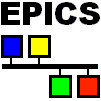

=========================================
 Integrating EPICS in GDA
=========================================

`EPICS <http://www.aps.anl.gov/epics/>`_

Integration of EPICS within GDA covers: 

* configuration of Java Channel Access (JCA);
* Diamond GDA-EPICS interface specification - the schema and XML files
* the creation of Scannables and Detectors that talk to EPICS as a Channel Access client allowing devices to be incorporated into a full Data Acquisition system;

Configure JCA
-------------

GDA uses Channel Access for Java (`CAJ <http://caj.cosylab.com/>`_) - 100% pure Java implementation of the EPICS Channel Access JCA library - to communicate with EPICS IOCs.

To enable GDA access to EPICS Processing Variables (PVs), GDA servers (or clients, if clients need to talk to PVs directly) must be started with a property **gov.aps.jca.JCALibrary.properties** setting,
for example::

-Dgov.aps.jca.JCALibrary.properties=${gda.config}/jca/live/JCALibrary.properties
 
The property file ``JCALibrary.properties`` should contain the following properties (corresponding to `EPICS Channel Access enviroment variables <http://www.aps.anl.gov/epics/base/R3-14/8-docs/CAref.html#EPICS>`_):

.. literalinclude:: JCALibrary.properties

Among these, the properties that are most often changed are::
    
    com.cosylab.epics.caj.CAJContext.addr_list           = 172.0.0.1
    com.cosylab.epics.caj.CAJContext.auto_addr_list      = false
    com.cosylab.epics.caj.CAJContext.repeater_port       = 6065
    com.cosylab.epics.caj.CAJContext.server_port         = 6064

for communicating with EPICS IOC running on your localhost and using CA server port of 6064.
  
GDA will also set **com.cosylab.epics.caj.CAJContext.event_dispatcher** to ``gov.aps.jca.event.SplitQueuedEventDispatcher``

The last two properties are CAJ specific. In most cases, you do not need to set them as the defaults are sufficient. However, if required, you can use these properties to customise CAJ's internal byte buffer size and thread pool size.

At Diamond, we run an EPICS simulation server on ``dasc-epics.diamond.ac.uk`` for off beamline development of GDA software. Its IP address is 172.23.7.113, server port is 6064, repeater port is 6065.

GDA-EPICS interface
-------------------

While it is possible to ``caget`` from and ``caput`` to a PV within GDA, just like on a console, at Diamond, a GDA-EPICS interface specification had been developed for the integration of an EPICS control system with a Diamond Data Acquisition system. 
This specification is described in a XML :download:`Schema <genericBeamlineSchema.xsd>`, which currently defines more than 60 types of devices available in this interface. 
The benefits of using a schema definition for this interface are:

* It ensures stability and compatibility on the interface between GDA and EPICS, in that the EPICS build system generates XML files for the interface that are always valid with respect to this schema, thus ensuring PVs served by EPICS IOCs always match what GDA expects;
* It delivers simplicity and device security by enabling us to only expose a subset of PVs for each of the devices that are required by experiment control and data acquisition processes;
* It is intuitive and transparent by grouping sets of PVs into logical units as devices which can be easily accessed using a domain-specific language, such as MotorType, provided by Java-XML data binding;
* It is extensible to allow new device types being added later as development requires.

The Java-XML data binding is generated from this schema using the `CASTOR source code generator <https://castor-data-binding.github.io/castor/>`_. 
Currently this is a manual process only required when the schema is updated. To build a new ``epics-xxx.jar``, you need to run Ant build on `build.xml` in ``uk.ac.gda.epics/epics.jar.generator/Epics_Interface (Phase II)/``. 
Please remember to change the version number in `build.xml` according to the instructions at the top so not to over-write existing epics jar files to allow the possibility of rollback. After the new ``epics-xxx.jar`` is generated, it must be added to the EPICS plugin's classpath to take effect. 

You can view the list of device types supported :download:`here <DeviceTypesSupported.txt>`

Access PV strings in ``BLxxI-gda-interface.xml`` file
-----------------------------------------------------

PV names of a device defined in the interface XML file can be accessed through the interface type classes in epics-xxx.jar generated above. 
For example, in an Epics Access class ``ADBaseImpl.java``, you can get an individual PV name string, say PV for temperature, by retrieving interface type configuration first then retrieving the PV of the ``Temperature`` element as::

	ADBaseType config = Configurator.getConfiguration(getDeviceName(), ADBaseType.class);
	String pvString = config.getTemperature().getPv()

You may already notice that we have followed a naming pattern here: ``<ADBase>`` element in ``BLxxI-gda-interface.xml`` is accessible using ``ADBaseType`` in epics-xxx.jar, which is used in the ``ADBaseImpl`` class. They all share the same base name ``ADBase``. 
This way we can easily find the interface type to use in Java classes from the XML interface file.

Fastest method to get/put in a script
-------------------------------------

* To get the value of pv test:sensor1::

    from gda.epics import CAClient
    ca = CAClient()
    val = ca.caget("test:sensor1")  

  returns String values, 

* To put to pv test:sensor1 a value of 1::

    from gda.epics import CAClient
    ca = CAClient()
    ca.caput("test:sensor", 1.0)  
    ca.caput("test:sensor", "1.0")  

  accepts native types and String

More performant method to get/put in a script
---------------------------------------------

* Create an object once and reuse::

    from gda.epics import CAClient
    ca = CAClient("test:sensor1")
    val = ca.caget()
    ... some time later
    ca.caput(1.0)
    ... when done close the channel
    ca.clearup()

* variations of caget/caput exist for different types
* caput can accept a listener or timeout

Using CAClient to make a Scannable
----------------------------------

* Defined class in epics_scannables.py::

    from gda.device.scannable import PseudoDevice	
    from gda.epics import CAClient
    class SimpleEPICSMonitor(PseudoDevice):
    	def __init__(self, name, pvstring, unitstring, formatstring):
    		self.setName(name);
    		self.setInputNames([])
    		self.setExtraNames([name])
    		self.Units=[unitstring]
    		self.setOutputFormat([formatstring])
    		self.ca=CAClient(pvstring)
    		self.ca.configure()

    	def rawGetPosition(self):
    		return self.ca.caget()

    	def rawAsynchronousMoveTo(self,position):
    		pass

    	def rawIsBusy(self):
    		return False

* Import the class definition and create the scannable::

    import epics_scannables
    sensor1 = epics_scannables.SimpleEPICSMonitor('sensor1', 
                                       'test:sensor1', 'mm', '%.4f')
    ....
    pos sensor1
    scan motor1 1. 10. 1. sensor1

Access EPICS in Java
--------------------

* A cut down Java Scannable class to get/put a double field::

    public class SimpleDoubleScannable extends ScannableBase{
    ... 
    configure(){
      controller = EpicsController.getInstance();
      channel = controller.createChannel(pvName);
    ...
    asynchronousMoveTo(Object value){
      busy = true;
      controller.caput(getChannel(), (Double) value, putListener);
    ...
    (In putListener putCompleted method set busy to false)
    ...
    boolean isBusy(){
      return busy
    ...
    Object rawGetPosition(){
       return controller.cagetDouble(channel);
    ...
    }

A General Purpose Class EpicsScannable
--------------------------------------

*  Use in script to get/set test:sensor2::

    from gda.device.scannable import EpicsScannable
    sensor2=EpicsScannable()
    sensor2.setName("sensor2")
    sensor2.setPvName("test:sensor2")
    sensor2.setUseNameAsInputName(True)
    sensor2.setUserUnits("mm")
    sensor2.configure()
    ...
    pos sensor2
    pos sensor2 "1.2 mm"
    pos sensor2 "1.2 m"
    

* Add to system using Spring::

    <bean id="sensor3" class="gda.device.scannable.EpicsScannable">
        <property name="PvName" value="test:sensor3"/>
        <property name="useNameAsInputName" value="true"/>
        <property name="userUnits" value="mm"/>
    </bean>
    

Particular device classes in GDA
--------------------------------

* Add to system using Spring::

    <bean id="m1_motor" class="gda.device.motor.EpicsMotor">
        <property name="pvName" value="test:m1"/>
        <property name="local" value="true"/>
    </bean>
    ...
    <bean id="m1" class="gda.device.scannable.ScannableMotor">
        <property name="motor" ref="m1_motor" />
    </bean> 

..
   Local Variables:
   mode: indented-text
   indent-tabs-mode: nil
   sentence-end-double-space: t
   fill-column: 70
   End:

