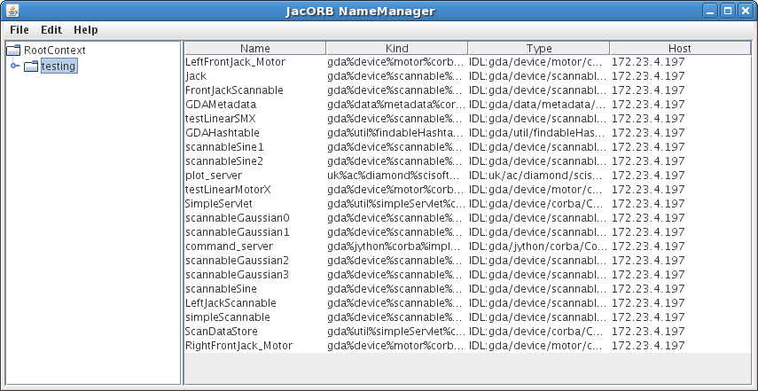

========
Remoting
========

CORBA in the GDA
================

Introduction
------------

This section describes how to create a new object and CORBA-enable it
- that is, create the additional files, interfaces and classes needed
for the clients to interact with the object remotely.

Writing the Java code
---------------------

Create the Java interface for the object
^^^^^^^^^^^^^^^^^^^^^^^^^^^^^^^^^^^^^^^^

For example, gda.device.detector.Phantom_.

Write an implementation of your interface
^^^^^^^^^^^^^^^^^^^^^^^^^^^^^^^^^^^^^^^^^

For example gda.device.detector.phantom.PhantomV73_.

Note that if the interface is ``some.package.Xxx``, the implementation
should be in ``some.package.xxx.SomeClass``.

In the case of the Phantom, the ``PhantomV73`` class fits into the
Device/Scannable/Detector hierarchy, but an object implementing the
IPhantomV73Controller_ interface is used to actually interact with the
hardware (or a simulation of it).

.. _gda.device.detector.Phantom: http://duoserv11.diamond.ac.uk:46060/browse/DLS-beamlines-i12/uk.ac.gda.beamline.i12/src/gda/device/detector/Phantom.java?r=HEAD

.. _gda.device.detector.phantom.PhantomV73: http://duoserv11.diamond.ac.uk:46060/browse/DLS-beamlines-i12/uk.ac.gda.beamline.i12/src/gda/device/detector/phantom/PhantomV73.java?r=HEAD

.. _IPhantomV73Controller: http://duoserv11.diamond.ac.uk:46060/browse/DLS-beamlines-i12/uk.ac.gda.beamline.i12/src/gda/device/detector/phantom/IPhantomV73Controller.java?r=HEAD

Creating CORBA-specific files
-----------------------------

Create an IDL that matches the Java interface
^^^^^^^^^^^^^^^^^^^^^^^^^^^^^^^^^^^^^^^^^^^^^
For example, `phantom.idl`_.

A few points: 

 * Note that whereas the Java interface is called ``Phantom``, the CORBA
   interface is called ``CorbaPhantom``.

 * Java and CORBA types are different; for example, a Java ``int``
   corresponds to a CORBA ``long``.

 * Input parameters must be prefixed with ``in``; for example:

::

   double getDemandVoltage(in long electrodeNumber) raises (device::corba::CorbaDeviceException);

.. _phantom.idl: http://duoserv11.diamond.ac.uk:46060/browse/DLS-beamlines-i12/uk.ac.gda.beamline.i12/src/idl/phantom.idl?r=HEAD

Compile the IDL to create CORBA classes
^^^^^^^^^^^^^^^^^^^^^^^^^^^^^^^^^^^^^^^

(It is no longer necessary to add the IDL file to an Ant script; the
``make-corba-jar`` target automatically picks up all IDLs.)

From the root of the GDA project, type::

   $ ant make-corba-jar

Or if this fails, try::
   
   ant -f build-classic.xml make-corba-jar 

which will create a new ``gda-corba.jar`` that will include new classes
for your object. For Phantom these classes include:

 * ``CorbaPhantomOperations`` - interface containing the Phantom-specific
   operations (e.g. ``setupForCollection``)
 * ``CorbaPhantom`` - interface representing the CORBA version of ``Phantom``;
   extends ``CorbaPhantomOperations`` plus some other CORBA interfaces
 * ``_CorbaPhantomStub`` - implements ``CorbaPhantom`` and makes the CORBA
   remote requests
 * ``CorbaPhantomHelper`` - various utility methods for working with
   ``CorbaPhantom`` objects

Write the CORBA implementation/adapter classes
^^^^^^^^^^^^^^^^^^^^^^^^^^^^^^^^^^^^^^^^^^^^^^

These classes must be located in the correct package so they are
found.

 * The interface for the device will be in ``some.package.Xxx``.
 * The ImplFactory_ requires the implementation class to be named
   ``some.package.xxx.corba.impl.XxxImpl``.
 * The AdapterFactory_ requires the adapter class to be named
   ``some.package.xxx.corba.impl.XxxAdapter``.

.. _ImplFactory: http://duoserv11.diamond.ac.uk:46060/browse/GDA-core/uk.ac.gda.core/src/gda/factory/corba/util/ImplFactory.java?r=HEAD

.. _AdapterFactory: http://duoserv11.diamond.ac.uk:46060/browse/GDA-core/uk.ac.gda.core/src/gda/factory/corba/util/AdapterFactory.java?r=HEAD

Implementation class
""""""""""""""""""""
For Phantom, this is  PhantomImpl_. 

The implementation class must extend your CORBA object's POA class (for Phantom, this is called ``CorbaPhantomPOA``). 

 * The class needs two fields: 

   * The real object - a ``Phantom`` instance in the case of the Phantom. 
   * A ``POA`` field. 
 * You need a 2-argument constructor which takes the "real" object and the
   ``POA``. ``ImplFactory`` will use this constructor.
 * Each method that you implement should delegate to the "real"
   object; any exceptions must be converted into CORBA-specific
   exceptions (e.g. ``DeviceException`` to ``CorbaDeviceException``). See
   ``PhantomImpl`` for examples of how to implement these methods.

.. _PhantomImpl: http://duoserv11.diamond.ac.uk:46060/browse/DLS-beamlines-i12/uk.ac.gda.beamline.i12/src/gda/device/detector/phantom/corba/impl/PhantomImpl.java?r=HEAD

Adapter class
"""""""""""""

For Phantom, this is PhantomAdapter_. 

The adapter class may extend other adapter classes but always needs to implement your Java interface (e.g. ``Phantom``). 

 * The class needs three fields: 

   * A CORBA object (e.g. a ``CorbaPhantom`` for the Phantom). 
   * A ``NetService``.
   * The object's name. 
 * You need a 3-argument constructor which takes a CORBA object, the
   object's name, and a ``NetService``. ``AdapterFactory`` will use this
   constructor.
 * Each method that you implement should delegate to the CORBA object;
   any CORBA exceptions must be converted into corresponding non-CORBA
   exceptions (e.g. ``CorbaDeviceException`` to ``DeviceException``). See
   ``PhantomAdapter`` for examples of how to implement these methods.

.. _PhantomAdapter: http://duoserv11.diamond.ac.uk:46060/browse/DLS-beamlines-i12/uk.ac.gda.beamline.i12/src/gda/device/detector/phantom/corba/impl/PhantomAdapter.java?r=HEAD

How the remote call works
-------------------------

Once the CORBA work has been done, the object can be used like this:

.. code-block:: java 

   MyObject myObject = Finder.getInstance().find("My_Object_Name");
   myObject.myMethod("foobar");

The way this is handled is as follows: 

 * ``myObject.myMethod("foobar")`` calls the corresponding method in the adapter. 
 * The adapter calls the CORBA stub. 
 * The CORBA stub makes the remote call across the network. 
 * On the server, the corresponding method in the implementation class is called by CORBA. 
 * The implementation class calls the "real" object. 

Validating CORBA JARs
---------------------

The compiled code in a CORBA JAR can get out of sync with the IDL file that was used to generate the code. A CORBA JAR
can be validated using ``gda-build.py``. For example:

::

  # validate the CORBA JAR in all plugins
  gda-build.py corba-validate-jar
  
  # validate the CORBA JAR in the specified plugins only
  gda-build.py -i core corba-validate-jar

This recompiles the IDL file to produce Java source code, then compiles the Java source code to produce class files.
The newly-compiled class files are compared to those inside the CORBA JAR. Any mismatches are reported.

Viewing objects bound in the name server
----------------------------------------

After a GDA object server has been started, JacORB's NameManager can be used to view the objects bound in the name
server.

The NameManager can be started using the ``gda`` launcher using the command:

::

  gda namemanager

This will launch the NameManager:

By default the ``gda`` launcher will try to automatically determine the location of the JacORB configuration directory,
which contains the ``etc/jacorb.properties`` file that specifies the location of the name server. (This directory is
typically ``$GDA_CONFIG/properties``.) If the directory cannot be determined automatically for any reason, or if you
want to use a specific JacORB configuration file, the JacORB directory can be specified manually:

::

  gda namemanager --jacorb=/path/to/jacorb/dir

The standard NameManager supplied with JacORB does not show all bound objects due to a bug.
The ``org.jacorb.naming.namemanager`` plugin contains a patch for this bug. If this plugin is present in your GDA
installation, it will automatically be included on the classpath. The plugin must be compiled for the patch to take
effect.

Alternatives to CORBA
=====================

Using RMI
---------

Using a standard RMI exporter/proxy
^^^^^^^^^^^^^^^^^^^^^^^^^^^^^^^^^^^

For newly-written objects, RMI can be used to make those objects available over the network.

Spring's
`RmiServiceExporter <http://static.springsource.org/spring/docs/2.5.x/api/org/springframework/remoting/rmi/RmiServiceExporter.html>`_
can be used on the server side to make an object remotely available. It must be told which object is being exported,
the name to export the object with, and the *service interface* - the interface defining the methods that should be available to
clients. For example:

::

  <!-- the object that is to be made remotely available --> 
  <bean id="server" class="...">
      ...
  </bean>

  <bean class="org.springframework.remoting.rmi.RmiServiceExporter">
      <property name="serviceName" value="gda/ProsilicaServer" />
      <property name="service" ref="server" />
      <property name="serviceInterface" value="gda.images.camera.prosilica.server.ProsilicaImageServer" />
  </bean>

On the client side, Spring's
`RmiProxyFactoryBean <http://static.springsource.org/spring/docs/2.5.x/api/org/springframework/remoting/rmi/RmiProxyFactoryBean.html>`_
can be used to generate a proxy to the object on the server. It will create a proxy object that implements the service interface;
each method makes a call to the remote object. For example:

::

  <bean id="prosilica_server" class="org.springframework.remoting.rmi.RmiProxyFactoryBean">
      <property name="serviceUrl" value="rmi://otherserver/gda/ProsilicaServer" />
      <property name="serviceInterface" value="gda.images.camera.prosilica.server.ProsilicaImageServer" />
      <property name="refreshStubOnConnectFailure" value="true" />
  </bean>

The ``refreshStubOnConnectFailure`` property causes the client to reconnect to the server if, for example,
the server is restarted. This allows a hot restart of the server without the need for the client to be restarted.

Note that using ``RmiProxyFactoryBean`` means that **every** call to a method in the service interface will
result in a remote method invocation. This is not appropriate, for example, for objects that implement
``IObservable`` for eventing. See the next section for a solution to this.

There are currently a number of issues that prevent this mechanism from being used instead of CORBA
for objects such as scannables:

 * The 'remote interface' defined by the CORBA IDL files, and the adapter and implementation
   classes, often differ from the methods implemented by the 'real' object. An object exported
   using ``RmiServiceExporter``, and a proxy automatically generated by ``RmiProxyFactoryBean``,
   would not account for these differences.

 * CORBA adapter and implementation classes often include additional logic not present in
   the 'real' object. They also sometimes carry out type conversion. Again, using the standard
   RMI exporter/proxy beans would not take these differences into account.

 * CORBA adapter and implementation classes often carry out conversions between 'real' exception
   types (such as ``DeviceException``) and CORBA-specific exception types (such as
   ``CorbaDeviceException``). This means that the exceptions that a client needs to be prepared
   to handle are often quite limited. Using an automatically-generated RMI proxy would mean that
   the client may need to be modified to deal with other exception types.

However, if you are developing new objects and wish to invoke methods remotely, using this mechanism
may be sufficient.

Using ``GdaRmiServiceExporter`` and ``GdaRmiProxyFactoryBean``
^^^^^^^^^^^^^^^^^^^^^^^^^^^^^^^^^^^^^^^^^^^^^^^^^^^^^^^^^^^^^^

Spring's ``RmiServiceExporter`` and ``RmiProxyFactoryBean`` classes are not appropriate when the server-side object
implements ``IObservable``, for two reasons:

* Although the object will be made available using RMI, so that clients can invoke methods on it, any events that the
  object generates will not be propagated to the client.
* On the client, a remote method invocation will be performed for *every* method in an object's service interface -
  including the ``IObservable`` methods, which will not work.

To export an object that generates events, the ``GdaRmiServiceExporter`` and ``GdaRmiProxyFactoryBean`` classes should
be used instead of ``RmiServiceExporter`` and ``RmiProxyFactoryBean`` respectively.

``GdaRmiServiceExporter`` exports an object using RMI in much the same way as ``RmiServiceExporter``, except that any
events generated by the object will be propagated through CORBA to clients.

``GdaRmiProxyFactoryBean`` creates a proxy that handles ``IObservable`` method calls locally. The proxy
is automatically connected to the CORBA event dispatch system, and registers to receive events related
to the server-side object. It also maintains a client-side list of observers. When events are received
by the client-side proxy, they will be dispatched to observers.

Care must be taken to ensure that the names of the server-side and client-side objects match, or events will not be
received. On the server, the ``GdaRmiServiceExporter`` will arrange for events to be sent using the name of the
underlying object. So for this:

::

  <bean id="A" class="...">
      ...
  </bean>
  
  <bean class="uk.ac.gda.remoting.server.GdaRmiServiceExporter">
      <property name="serviceName" value="..." />
      <property name="service" ref="A" />
      <property name="serviceInterface" value="..." />
  </bean>

events will be sent with the object name ``A``. On the client, the ``GdaRmiProxyFactoryBean`` must also be called ``A``,
as otherwise it will not receive events from the server-side object called ``A``.

::

  <bean id="A" class="uk.ac.gda.remoting.client.GdaRmiProxyFactoryBean">
      ...
  </bean>
