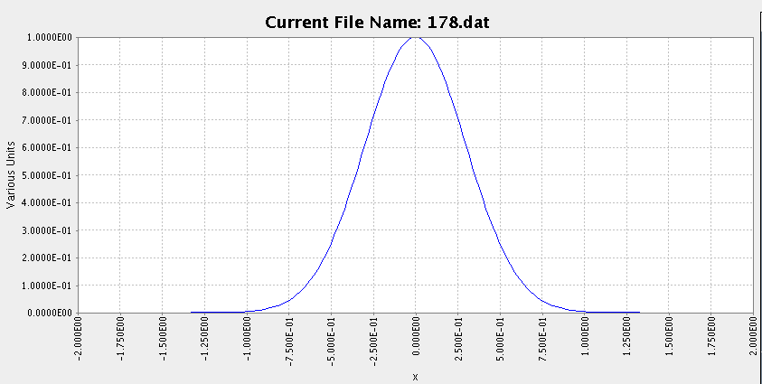
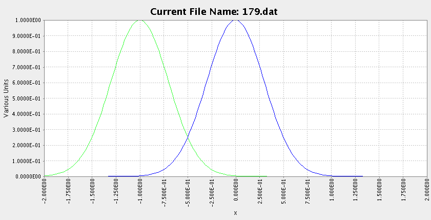
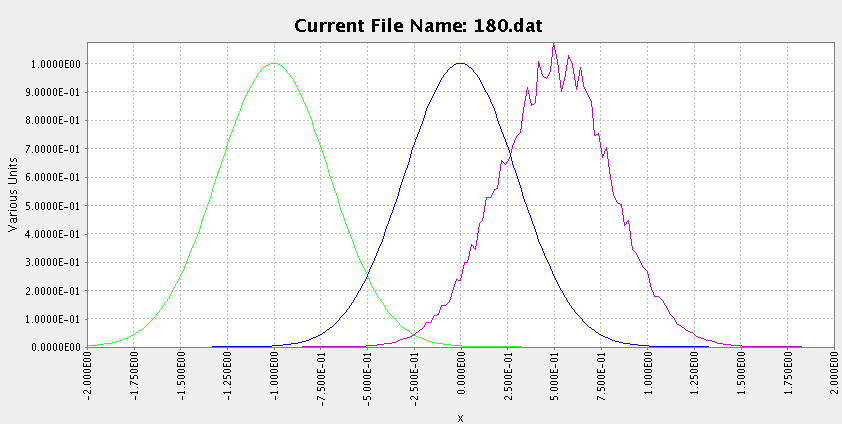
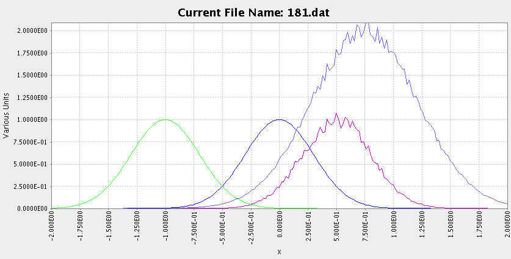
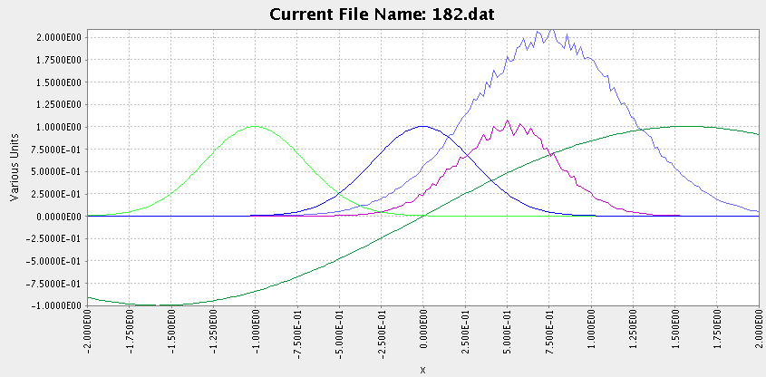
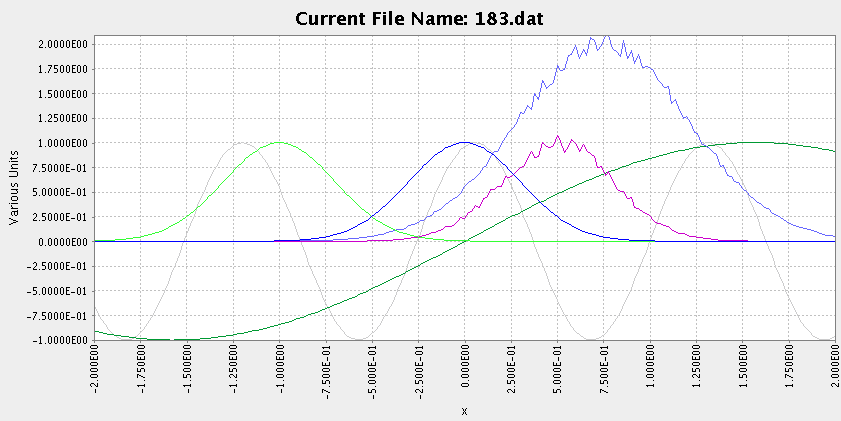
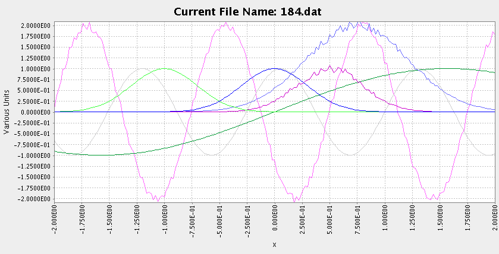
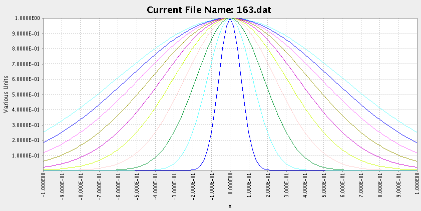

======================
 The GDA Command line
======================

Background
----------

The scripting engine of the GDA is an extended version of Jython
(Python implemented in Java). It is now common across all current
beamlines at Diamond. It is used extensively on measurement beamlines
such as I02-I04 and I22 to provide the underlying command
infrastructure to support the Graphics User Interfaces (GUIs). It has
proven very popular particularly on the experimental beamlines such as
I06, I15, I16 and I18 where it provides command-line control of
experiments to perform scans, creates bespoke objects to operate
within those scans and enables general automation of experimental
procedures.

The great advantage of Jython is that its syntax and functionality
very closely resembles that of the widely used and popular Python
language with the additional advantage that most Java libraries are
automatically available. The language and concepts have proven easy to
learn by non-specialised programmers and there has been a very
significant uptake from Diamond beamline staff to do customisation of
beamline operations.

Basic Concepts
--------------

The scripting language in the GDA is Jython, which is Python
implemented in Java. Python was developed to have a simple and quick
to learn syntax while still remaining a fully-featured programming
language. Some basic concepts used in the GDA Jython environment which
are listed in more detail in the later sections of this guide:

#. In the GDA Client, Jython commands may be typed in the
   JythonTerminal panel which provides a terminal-like prompt, or scripts
   (macros) may be typed in, saved and run from the JythonEditor panel.
   It is useful to note that the same commands can be used in both
   panels, and that they both use the same namespace in Jython i.e. a
   variable defined in the Jython command-line will be accessible from
   within scripts and vice-versa. User scripts must be stored in
   /dls/iXX/scripts (where XX is the beamline number).
#. There is a core set of commands for operating the beamlines. These
   are known as the GDA 'extended syntax' as to use these commands you do
   not have to use 'proper' Jython syntax. To save typing when using
   these commands you may omit brackets and commas. For example, instead
   of typing::

       >>> pos(myMotor,10)
  
   you only have to type::

       >>> pos myMotor 10
						
   (Although the first version is still a valid command to type). This is
   convenient for the most common commands. It is possible to dynamically
   extend the syntax in this way with your own commands using the 'alias'
   command.
#. Data is normally collected in beamlines using scans. Most scans are
   stepped scans i.e. move motors, collect data from detectors. move
   motors, collect data from detectors...etc. So to do this, scans
   contain two types of objects: detectors and 'Scannables'. Scannable
   objects conceptually act like motors in the sense that they have a
   position and you can move them, but they can represent anything from
   low-level hardware to a complex calculation. Scans may be nested with
   no limit to the number of dimensions.
#. The data collected by scans is plotted live to the GDA Client. Scan
   data (from old data files as well) is held inside data objects which
   can be plotted or be used in mathematical operations.

Code Completion
---------------

Code completion is available on the command line. This can be triggered using either
`Ctrl-Space` (similar to eclipse) or `tab` (similar to bash/zsh etc).

If there is only one option, it will automatically inserted

    >>> conti<TAB>
    >>> continue

If there are multiple choices, they will appear in a popup above the cursor. Typing will
continue to filter the options and `tab` or `enter` will insert the selected one.

.. note:: a `tab` will still indent code if the cursor is at the beginning of the line

       >>> |print 'helloWorld'
       >>>     |print 'helloWorld'

Example usage of the main Jython GDA commands
---------------------------------------------

List all scannable objects::

   >>> pos

Help::

   >>> help

List all devices::

   >>> ls

List all scannable devices (devices that implement the Scannable interface)::

   >>> ls Scannable

Import demo scannable definitions::

   >>> import scannableClasses
   >>> from scannableClasses import *

Make a new instance of SimpleScannable::

   >>> simple = SimpleScannable('simple', 0.0)

Scan `simple` from 0 to 1 in steps of 0.01::

   >>> scan simple 0.0 1.0 0.01

Get current position of `simple`:

>>>pos simple

Move `simple` to 0.5:

>>>pos simple 0.5

Delete an existing object::

   >>> del simple

See the Jython training manual for more detailed descriptions and
further examples.

Example devices
~~~~~~~~~~~~~~~

A Jython module containing several demonstration scannable objects is
contained in the user scripts folder
('documentation/users/scripts/scannableClasses.py'. This file can be
opened, viewed and edited in the Jython Editor view in the GDA
client. (If this view is not visible at startup, select the
'JythonEditor' view from the View menu in GDA.)

New users can gain familiarity with the Jython terminal by following
the examples below. Users should type in the Jython commands below
from the GDA Jython Scripting Terminal. Each command follows the
Jython terminal prompt '>>>'. A short description precedes each
command or set of commands.

To superimpose successive scans on previous scans, the 'Create new
graph' and 'Clear old graphs' should be left unchecked.

Import all the classes from the demonstration 'scannableClasses'
module (if not already done so above)::

   >>> import scannableClasses
   >>> from scannableClasses import *

Help is available for most of these classes::

   >>> help ScannableGaussian
   >>> help ScannableSine

Make an instance of ScannableGaussian::

   >>> sg = ScannableGaussian('sg', 0.0)

Scan it from -2 to 2 in steps of 0.02::

   >>> scan sg -2.0 2.0 0.02

Change its centre to -1 and rescan::

   >>> sg.centre = -1
   >>> scan sg -2.0 2.0 0.02

Move again, add some noise, and rescan::

   >>> sg.centre = 0.5
   >>> sg.noise = 0.2
   >>> scan sg -2.0 2.0 0.02

Make a new instance of ScannableGaussian, setting values for its
additional optional properties, and scan it::

   >>> sg2 = ScannableGaussian('sg2', 0.0, centre=0.75, width=1.54, height=2.0, noise=0.1)
   >>> scan sg2 -2.0 2.0 0.02

Make an instance of a ScannableSine class and scan it::

   >>> ss = ScannableSine('ss', 0.0)
   >>> scan ss -2.0 2.0 0.02

Change the period and phase of ss and rescan::

   >>> ss.period = 0.2
   >>> ss.phase = 1.0
   >>> scan ss -2.0 2.0 0.02

Change the magnitude, phase, and noise, of the sine, and rescan::

   >>> ss.magnitude = 2.0
   >>> ss.phase = 0.5
   >>> ss.noise = 0.2
   >>> scan ss -2.0 2.0 0.02

Multiple scans can also be nested to an arbitrary level. To illustrate
a nested scan with two levels, i.e. an inner scan nested within an
outer scan, we can define the outer scan to set the value of the inner
scan. The example class ScannableGaussianWidth in the scannableClasses
module (in directory documention/users/scripts) takes an existing
ScannableGaussian instance, and sets the width of the
ScannableGaussian to its own current value. The enclosed
ScannableGaussian can be scanned at each width across a user-defined
range.

Instantiate a new inner ScannableGaussian and then a new ScannableGaussianWidth::

   >>> sgi = ScannableGaussian('sgi', 0.0)
   >>> sgw = ScannableGaussianWidth('sgw', sgi)

Perform the nested scan::

   >>> scan sgw 0.2 2.0 0.2 sgi -1.0 1.0 0.02

The results of this scan in the Terminal plot window are shown below:

Using the plotting functions in GDA
~~~~~~~~~~~~~~~~~~~~~~~~~~~~~~~~~~~

Apart from the basic plotting window in the Terminal view which
displays the current scan, GDA also has some advanced plotting
capabilities for previously-recorded scans. These are designed for
post-scan analysis and visualisation. 

All the information about this kind of analysis is available in 
the User guide for the 'Diamond Scisoft Data Analysis Plugin'

Sources for help
----------------

+ Beamline manuals which list how to use the specific panels and
  Jython objects used on that beamline.
+ Useful Jython websites:
+ The help command in the GDA Jython interpreter.
