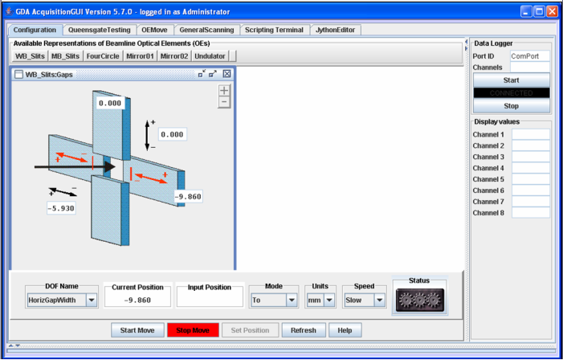

=======================
Introduction to the GDA
=======================

This guide is intended to give an overview of the GDA framework and
explain the functionality of the Jython scripting environment embedded
within it. This includes how to write scripts, perform data collection
by scans and plot data from scans. It does not cover the beamline- or
technique- specific parts of the GDA.

This guide explains: How to use the GDA. Where and how your data will
be stored. How to perform experiments using basic commands such as
scan. Guidelines on writing Jython scripts and Jython modules. Coding
and documentation standards. Advanced scripting tools. How to write
your own Scannables - the objects which are controlled by scans.

.. note::

   Some of this chapter is specific to gda use at Diamond.

The GDA Project
---------------

The Generic Data Acquisition (GDA) framework is a Java-based
distributed system used on Diamond's beamlines to control experiments
and collect data. The project to develop the software was initiated at
SRS, Daresbury until release 4.2 in October 2003. From then it was co-
developed by teams from both facilities until release 7.0.0 in late
2007. Since then Diamond's GDA has been purely developed by the Data
Acquisition and Scientific Computing Group.

Each beamline uses a copy of the GDA software configured for its own
particular hardware and experimental requirements. Experiments can be
controlled using beamline- or technique-specific GUI panels, a
command-line terminal or by writing and running scripts (macros).

Logging onto a beamline workstation
-----------------------------------

The GDA software is run from workstations on the beamline. Beamlines
use one of two methods to log into these workstations:

#. Shared user account login. On some beamlines you will login to the
   same shared user account. The name of this account is the name of the
   beamline followed by 'user' all in lower case. For example, if your
   beamline were I01 the account would be 'i01user'. The password to
   login using this type of account will be given to you by the beamline
   staff. Note however that the workstations on beamlines that use this
   method will be automatically logged in to this account when started or
   rebooted.
#. FedID account login. On other beamlines you will login using your
   own Facilities user FedID name and password issued to you by the User
   Office.

As of March 1st, 2007 all beamlines use the first, shared account
method, but this will change. It is sometimes possible to control the
beamline from the outside by logging into one of these workstations
remotely.

Regardless of how you login on the beamline the GDA system will store
your data (and some other files) in a shared location on your
beamline's storage server. Read access control to this data will be
determined by beamline staff. Let them know if you are concerned about
the security of your data. This storage server is described in the
following section.

Starting the GDA
----------------

Before starting the GDA software you may have to set up the shell
environment. If you login with your own FedID account type::

    source /dls/ixx/etc/ixx-profile.sh

Starting the GDA is a two step process. The bulk of the GDA software
is started from a terminal by typing::

    gdaservers
    			
from a Linux terminal or::

   gdaservers.bat
    			
from a Windows terminal. This starts up the GDA server software on one
of the beamline's central control server machines. This software may
be running before you start using the system, but asking it to start
again causes no harm. A GUI client is used to interact with this
server. About 30s after starting the server you should see the message
"Server Initialisation Complete". Then type::

    gdaclient
    			
from a Linux terminal, or::
    
    gdaclient.bat
    			
from a Windows terminal to start the GUI client. The GUI client will
ask you for a name and password when it starts up. This name is used
by the GDA to determine where to put your data. If you have logged in
to your own user account using a FedID, select the option to
automatically use the FedID of that account. Otherwise if you are
logged into a shared user account, give it your FedID and password
allocated by the User Office.

If you try to start the GDA client and get a string of connection
errors followed by a final "Can't find a Command Server" error, either
the server is not running and needs to be started or you didn't wait
long enough before starting the client. You may close the GDA client
software running on your workstation without effecting the operation
of the command server. If you need to leave your computer, rather than
locking the screen to prevent access to the GDA command server, you
may close the client software and log off. You may then login and
start up the client server again and begin where you left off.

The GDA Client
--------------

The GDA client acts as an interface to the command server. The client
has a GUI with a number of panels accessible via tabs. The available
panels vary by beamline. Depending on the nature of your experiment
and beamline you may be able to use experiment-specific panels to
control the beamline. Other useful panels include:

+ A configuration panel that has a number of pictures showing each
  piece of controllable hardware (or optical elements) on the beamline.
  These pictures also provide one mechanism for moving these elements.
+ A scripting terminal panel that provides a versatile way to control
  these elements and perform experiments.
+ A Jython editor panel that provides a way to write scripts that can
  be saved and then run using a button in this panel.

Methods to control the beamline using these panels are described in
the rest of this manual.

Basic Control
-------------

The hardware that can be controlled by the GDA on your beamline is
displayed on the configuration panel. Whether you intend to use this
panel or not, this section provides an introduction to controlling the
hardware on a beamline. In the configuration panel, clicking on each
of the available Optical Elements (OEs) will show an interactive
picture of that element.

   OE configuration panel

The hardware that can be controlled by the GDA on your beamline is
displayed on the configuration panel. Whether you intend to use this
panel or not, this section provides an introduction to controlling the
hardware on a beamline. In the configuration panel, clicking on each
of the available Optical Elements (OEs) will show an interactive
picture of that element.

Data Storage
------------

All experimental results will be saved initially on a beamline's
central storage area. You will not normally have much choice in where
your experimental data is stored. The GDA software saves the results
from each experiment or scan in a standard place. This rigidity allows
the data to be migrated away from the beamline and to be backed up,
archived, and made accessible via projects such eScience and iGrid.

Storage directory path
~~~~~~~~~~~~~~~~~~~~~~

Each beamline has a storage server with upwards of 5Tbytes of storage.
When you log into your user account a directory from this storage
server is automatically mounted. The name of this directory and path
to access it depends upon your beamline's name. Every beamline has a
three digit, lower-case identifier such as i01 or b01. Using i01 as an
example, the directory on a Linux workstation would be::

     i01-storage.diamond.ac.uk:/dls/i01, mounted as /dls/i01
   				
On Windows workstation the directory would be::

    //i01-storage.diamond.ac.uk/i01, mapped to X:

Note: If you need to access the identifier for your beamline, it is
stored within your account space as an environment variable called
BEAMLINE.

Storage directory structure
~~~~~~~~~~~~~~~~~~~~~~~~~~~

There is one common directory on a beamline's storage server. Data
from all users and experiments is stored here. It contains the
following sub-directories::
       
    	storagedir
    	|_ data         The GDA stores data here
    	|_ scripts      GDA Scripts used to control experiments
    	|_ logs         The GDA stores log files here
    	|_ spool        Beamline systems store temporary files here
    				

The data directory contains the data for all the experiments performed
recently on the beamline. Each experiment will be identified by the
year it was performed in, the proposal number assigned by the User
Office, and a visit number. The visit number will normally be 1 unless
an experiment takes more than one visit to Diamond to complete. For
each experiment, the GDA software will create a sub-directory within
the data directory according to this pattern::

   /dls/<beamline>/data/<year>/<sciencearea><proposal>-<visit>

For example, data on beamline i18 (spectroscopy), for proposal
identifier 1243 on the first visit would be stored in:
/dls/i18/data/2007/sp1234-1 under Linux X:\data\2007\sp1243-1 under
Windows.

Data Files
~~~~~~~~~~

Most experiments are composed of a number of scans. A typical scan
involves rotating a sample through a number of angles taking a
measurement or an image at each. Each successive scan you perform is
assigned a sequential number called the scan number. The results from
performing a scan will be stored in the current experiment directory
with the name::

     <beamline>-<scan number>.<extension>

where the extension depends on the type of scan. Such a file is
typically a set of tabular data describing the points scanned and the
value of certain measured parameters.

Some scans, such as those where images are taken, will result in more
than one data file. In this case each file resulting from that scan is
also given a sequence number resulting in a set of files named::

    <beamline>-<scan number>-<sequence number>.<extension>

This system is due to be replaced by a NeXus system where each scan
results in only one file (see below). Also, this naming scheme may not
be adhered to on some of the MX beamlines where analysis software that
requires different naming schemes is sometimes used.

Example storage directory
~~~~~~~~~~~~~~~~~~~~~~~~~

The following shows an example storage directory structure on the
imaginary beamline i01.

.. sourcecode:: python

    
    	storage
    	|_ scripts
    	|_ logs
    	|_ spool
    	|_ data
    	|
    	|_ 2007
    	|  |
    	|  |_ expa-1           Proposal called exp1, first visit
    	|  |  |_i01-1.nxs      data from 1st scan
    	|  |  |_i01-2.nxs      data from 2nd scan
    	|  |  |_i01-3.nxs      data from 3rd scan
    	|  |
    	|  |_ expb-1           Proposal called expb, first visit
    	|     |_i01-1.nxs      tabular data from 1st scan
    	|     |_i01-1-1.jpg    1st CCD image
    	|     |_i01-1-2.jpg    2nd CCD image
    	|     |_i01-1-3.jpg    3rd CCD image
    	|     |_i01-2.nxs      tabular data from 2nd scan
    	|     |_i01-2-1.jpg    1st CCD image
    	|     |_i01-2-2.jpg    2nd CCD image
    	|     |_i01-2-3.jpg    3rd CCD image
    	|
    	|_ 2008
    	   |
    	   |_ expa-2           Expa's second visit
    	      |_i01-1.nxs      data from 1st scan
    	      |_i01-2.nxs      data from 2nd scan
    	      |_i01-3.nxs      data from 3rd scan

Transition to NeXus data files
~~~~~~~~~~~~~~~~~~~~~~~~~~~~~~

The system for storing data files described above is being replaced by
one based on the NeXus format which is being developed as an
international standard for representing results from neutron, x-ray
and muon sources. With this method each scan will always produce only
one file containing all the data.

This new method will be phased in during 2008, and is currently
available for testing. In order to turn on NeXus file writing then
just set the java property::

     gda.data.scan.datawriter.dataFormat=NexusDataWriter

During the testing phase this will also produce a legacy SRS type
format file.