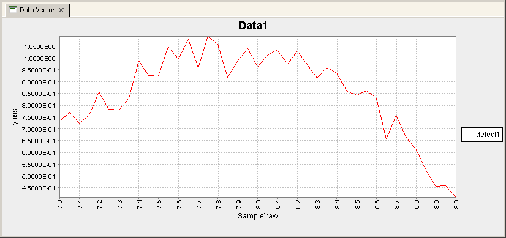
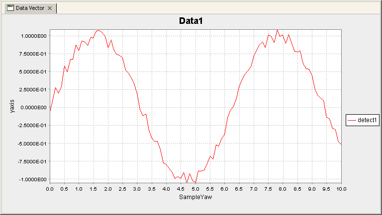
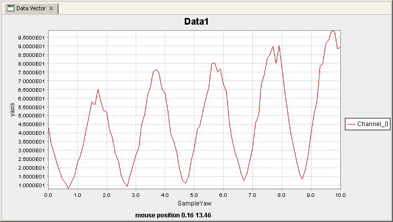
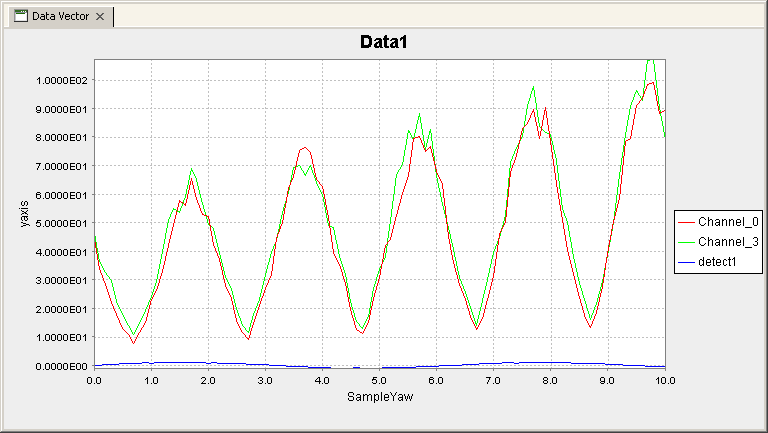
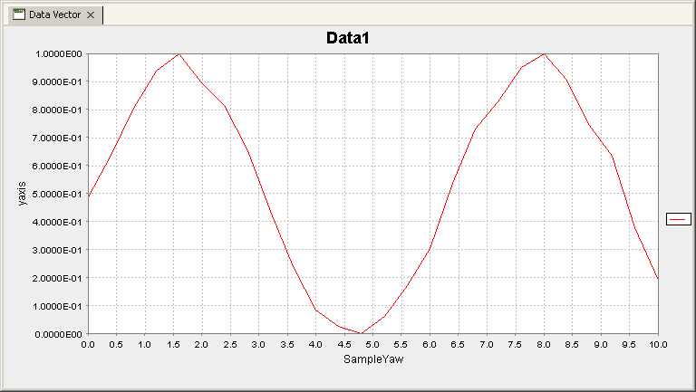
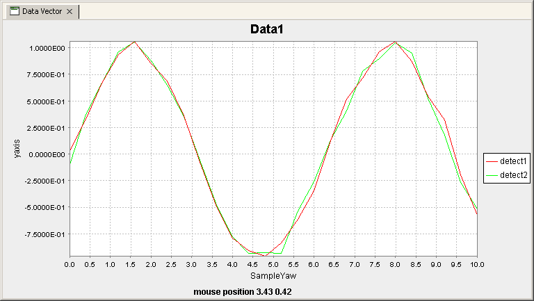
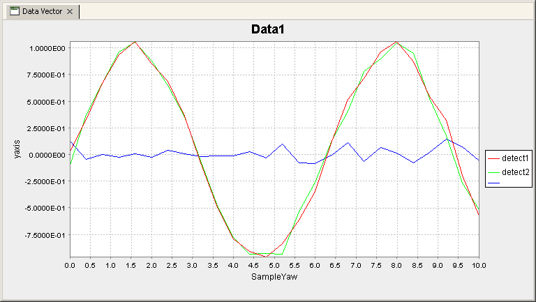
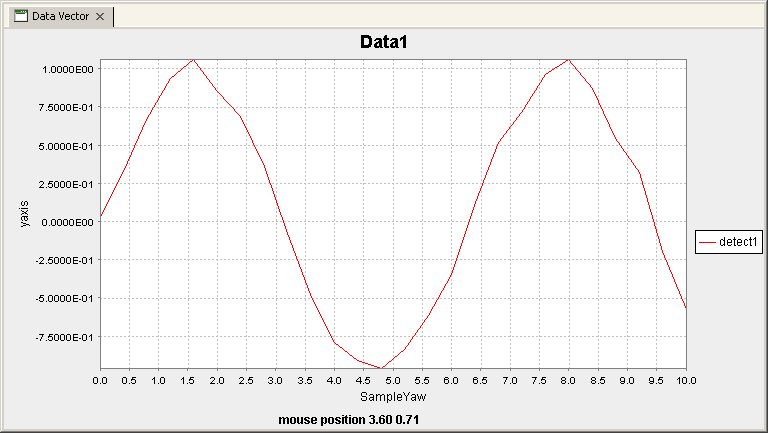
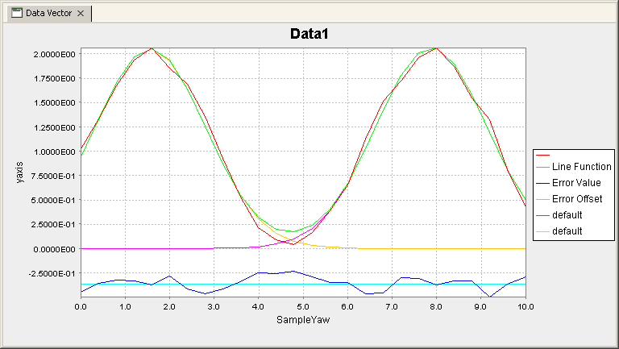

==========
 Plotting
==========

ScanFileHolder Class
====================

The first class to be detailed here is the ScanFileHolder. This class
acts as storage for a single scan, the idea behind this is that
multiple scans can be loaded in, and then either checked or compared
as is required. The basic functionality shown here can all be
incorporated into scripts or used as is in the jython terminal. All
the examples shown here are for use in the Jython terminal, and are
based on some scans being performed on simulated or real components.

Basic introduction to Loading and Visualising files
---------------------------------------------------

The Data Analysis and Visualisation toolkit for the GDA is designed to
make the visualisation and manipulation of all data collected on the
beam-line quick and effective. This documentation will concentrate on
demonstrations and examples, so having a working copy of the GDA
attached to the DLS network would be useful. Lets Start with a brief
example of how to load in a scan file and visualise the data. To Start
with the following script is an example of loading in a previous scan
and visualising some of the data.

.. code-block:: python
   :linenos:
    
   >>> data = ScanFileHolder()
   >>> data.loadSRS()
   >>> data.info()
   Trying to open /home/ssg37927/gda/gda-7.4/users/data/70.dat
   ScanFileContainer object containing 41 lines of data per DataSet.
   0	    SampleYaw
   1	    detect1
   2	    detect1
   3	    time
   4	    I0
   5	    It
   6	    If
   7	    TEY
   8	    PEY
   9	    FY
   10	    Drain                  
   >>> data.plot(0,1)
    				

This should display the following in the "Data Vector" tab in the GDA:

Remember that you can undock the "Data Vector" tab and put it wherever
is easiest to see it, such as on another screen or beside the Jython
terminal.

Going through the script line by line:

**01**
   Creates the object which will hold all the data we want to manipulate and visualise.

**02** 
   This command tells the data object to load in the last SRS datafile
   created by the GDA. This can be expanded to various different
   things depending on what is needed. If a positive integer is
   given(###), then the SRS datafile of that name is loaded (###.dat)
   from the current working directory. If a negative integer is given,
   then the scan performed that many times previously is loaded, for
   example loadSRS(-2) will load the scan performed 2 before the
   current one. If the full path and filename to a particular SRS file
   is given, then that is the one which will be loaded.

**03** 
   This command displays a an outline of the data inside the
   object. This allows easy identification of files as well as direction
   for the plotting commands and others

**04-16** 
   This is the output from the previous command, showing
   information about what has been read in from the file.

**17**
   This command plots data from the object out to the Data Vector panel 

Plotting examples
-----------------

One of the functions available in the Analysis and Visualisation
toolkit is the ability to quickly look at collected data from within
the GDA. In the previous example we saw a simple plot of 1 set of
collected data against another, but there is other functionality
available. The following script uses Various different forms of the
print command. It Also makes use of another version of the "loadSRS"
command. This only works however on scans which have been recorded in
the current directory and won't work if the data directory has been
changed since the scan was taken.

.. code-block:: python
   :linenos:
    
   >>> data = ScanFileHolder()
   >>> data.loadSRS(-13)
   >>> data.info()
   ScanFileContainer object containing 101 lines of data per DataSet.
   0	SampleYaw
   1   detect1
   2	detect1
   3	time
   4	I0
   5	It
   6   If
   7	TEY
   8	PEY
   9   FY
   10	Drain
   11	Channel_0
   12	Channel_1
   13	Channel_2
   14	Channel_3
   15	Channel_4
   16	Channel_5
   17	Channel_6
   18	Channel_7                    
   >>> data.plot(0,1)
   >>> data.plot("SampleYaw",11)
   >>> data.plot("SampleYaw",[11,"Channel_3",1])

Should provide the following outputs:

				

**01**
   creates the object which will hold all the data we want to manipulate and visualise.

**02**
    Loads in the scan that was taken 13 scans ago.

**03** 
   This command displays a an outline of the data inside the
   object. This allows easy identification of files as well as
   direction for the plotting commands and others

**04-23**
   This is the output from the previous command, showing
   information about what has been read in from the file.

**24**
   This simple plot command plots the data highlighted in line 05
   of the code, against that in line 06 of the code. These are marked
   by the numbers 0 and 1, and that corresponds to there places in the
   file. The first value is the x axis, and the second is the Y axis
   which is to be plotted.

**25**
   This plot command makes use of the ability to use either the
   number representing the data, or the name of the data to plot the
   information.

**26** 
   In this plot, a list is used as the y axis, and as can be seen
   from the diagram, all of the y axis are plotted here on the
   diagram. This also shows that numbers and names can be mixed in the
   list freely, making access to specific data relatively easy.

Retrieving Data
---------------

The next section shows a lot of information about manipulating data
once it is in the form of a dataset. The ScanFileHolder is essentially
a container for lots of different datasets, and getting them out to
look at more closely can be done in several ways.

.. code-block:: python
   :linenos:
    
   >>> data = ScanFileHolder()
   >>> data.loadSRS(-31)
   >>> data.info()
   ScanFileContainer object containing 21 lines of data per DataSet.
   0	SampleYaw
   1    detect1
   2    time
   3	I0
   4    It
   5    If
   6	TEY
   7	PEY
   8    FY
   9	Drain
   10	Channel_0
   11	Channel_1
   12	Channel_2
   13	Channel_3
   14	Channel_4
   15	Channel_5
   16	Channel_6
   17	Channel_7
   >>> dataset1 = data.getAxis("detect1")
   >>> dataset1.disp()
   DataVector Dimentions are [21]
   [-5.5897e-02, 2.4862e-02, 2.9554e-01, 2.7648e-01, ...
   >>> dataset1 = data.getAxis(10)
   >>> dataset1.disp()
   DataVector Dimentions are [21]
   [1.9380e+01, 1.4850e+01, 2.1220e+01, 2.9110e+01, ...
   >>> dataset1 = data[11]
   >>> dataset1.disp()
   DataVector Dimentions are [21]
   [2.2580e+01, 1.4330e+01, 2.4240e+01, 3.1930e+01, ...                    
    				

**01** 
   creates the object which will hold all the data we want to
   manipulate and visualise.

**02**
   Loads in the scan that was taken 31 scans ago.

**03** 
   This command displays a an outline of the data inside the
   object. This information will be used here to assist in getting
   particular data out of the object

**04-22**
   This is the output from the previous command, showing
   information about what has been read in from the file.

**23**
   This command creates a dataset from the information in the
   ScanFileHolder associated with the title "detect1"

**24**
   This command displays the information inside the new dataset,
   including its size and the data contained within.

**25-26** The output from the disp() command

**27**
   This command creates a dataset from the information in the
   ScanFileHolder associated with the position 10. This represents
   "Channel_0" as seen in line 15

**28**
   The disp() command again, showing the now different data held in
   the dataset.

**29-30**
   The output from the disp() command

**31**
   This command uses the Pycontainer aspect of the dataset to allow
   very quick access to the ScanFileHolder.

**32**
   The disp() command again, showing the now different data held in
   the dataset.

**33-34**
   The output from the disp() command

Full Method Listing
-------------------

The table provided here provides in full detail the main functions of
the ScanFileHolder Class

 
.. class:: ScanFileHolder

   .. method:: getAxis(int n)

      Returns a Dataset corresponding to the input number.

   .. method:: getAxis(String name)

      Returns a Dataset corresponding to the input String in the header.

   .. method:: getImage()

      Returns a copy of the Dataset that contains the image data, if an
      image has been loaded into the ScanFileHolder. *Deprecated*

   .. method:: getPilatusConversionLocation()

      Returns the location of the Pilatus conversion software

   .. method:: setPilatusConversionLocation(String path)

      Sets the location of the Pilatus conversion software

   .. method:: getPixel(int x, int y)

      Returns the Double value of the pixel at (x,y)

   .. method:: info()

      Prints a description of the ScanFileHolder to the Jython terminal

   .. method:: loadPilatusData(String path)

      Loads in the Pilatus tif specified in the input, this needs to be a
      full filename specification.

   .. method:: loadSRS(int scan_no)

      If the number is positive, then this is the number of the SRS
      datafile which will be loaded from the current directory. If the
      number is negative, then the current file number is found, and the
      input number removed from it, and that SRS file is loaded in. For
      example if the current scan number is 12 and -4 is input, then
      "8.dat" will be loaded.

   .. method:: loadSRS()

      Loads in the data from the last scan to be performed

   .. method:: loadSRS(String path)

      Loads in the SRS datafile specified by the filename in the input

   .. method:: ls()

      Displays to the Jython Terminal all the data names in the
      ScanFileHolder

   .. method:: plot()

      This plots the Image to the "Data Vector" tab in the GUI

   .. method:: plot(int axis)

      Plots the axis specified from a number of sources. If the input is
      a string, then that is the name of the axis to be plotted. If the
      input is a number, then that is the number of the axis to be
      plotted. If the input is a dataset, then that dataset is plotted.

   .. method:: plot(int xaxis, int yaxis)

      As the above plot, but the yAxis can also accept a list of any type
      of parameter as specified above

   .. method:: setImage(DataSet)

      Copies the input dataset into the image dataset in the
      object. *Deprecated*

   .. method:: setImag(int height, int width, double[] Data)

      Generates a dataset from the input variables and then copies it
      into the image dataset in the object. *Deprecated*

DataSet Class
=============

The DataSet class is the core of all the fitting and visualisation
architecture presented here. It is a N dimensional expendable
container, which can be manipulated and visualised in many different
ways. As was seen in the section on ScanFileHolders, the internals of
these objects are datasets. In this section we will detail some of the
uses of the dataset including manipulation and direct plotting.

Initial use of the dataset
--------------------------

The DataSet is the main way of handling sets of data in the GDA. There
are many different ways of manipulating the dataset data. The
following script demonstrates a few of these methods, as well as
showing how to get the datasets out of a ScanFileHolder.

.. code-block:: python
   :linenos:
    
   >>> data = ScanFileHolder()
   >>> data.loadSRS(1)
   >>> data.info()
   ScanFileHolder object containing 26 lines of data per DataSet.
   0	SampleYaw
   1	detect1
   2	detect2                    
   >>> dataset1 = data[1]
   >>> Plotter.plot("Data Vector",data[0],dataset1)
   >>> dataset1.max()
   1.0630006379056933
   >>> dataset1.min()
   -0.9609246487585549
   >>> dataset1 -= dataset1.min()
   >>> dataset1 /= dataset1.max()
   >>> dataset1.max()
   1.0
   >>> dataset1.min()
   0.0
   >>> Plotter.plot("Data Vector",data[0],dataset1)
    				
The idea here is to normalise the data between O and 1, and then to
plot it out. This should Produce graphical output as shown below.

01
   creates the object which will hold all the data we want to
   manipulate and visualise.

02 
   Loads in the scan that has the identifier "1.dat".

03 
   This command displays a an outline of the data inside the object.

04-07 
   This is the output from the previous command, showing information
   about what has been read in from the file.

08 
   This command creates a dataset from the information in the
   ScanFileHolder associated with the position 1 in the
   ScanFileHolder. In this case, this is the data which was collected by
   "detect1"

09 
   This command plots the information to the plotting window using the
   core functions which are wrapped by the ScanFileHolder class in the
   .plot() command. The first entry is the name of the panel to which the
   drawing should occur, the second is a dataset containing the x axis
   information, in this case gathered directly from the ScanFileHolder
   using the collection Jython methods used before, i.e. data[0]. The
   third value is the y axis, once again, this can be a dataset, or a
   list of datasets.

10-11 
   This uses one of the various datamining functions of the
   dataset, this returns the maximum element value in the dataset.

12-13
   This command returns the minimum element value of the dataset.

14 
   This line makes use of the datasets a -= b operator which does the
   equivalent of a = a - b. In this case we are subtracting the minimum
   value of the dataset from every element of the dataset.

15 
   This line takes the dataset and divides every element by the
   maximum value of the dataset.

16-19 
   Running the previous commands to check that the max value is now
   1.0 and the minimum value is now 0.0.

20 
   Replot the data, to show that it now lies between 0.0 and 1.0, and
   is still the same profile as previously.

Combinations of DataSets, and statistical analysis
--------------------------------------------------

Sometimes it can be useful to see the differences or similarities
between two scans, or two detectors in the same scan. The following
script highlights the noise between two different signals and
evaluating that difference statistically.

.. code-block:: python
   :linenos:
 
   >>> data = ScanFileHolder()
   >>> data.loadSRS(1)
   >>> data.info()
   ScanFileHolder object containing 26 lines of data per DataSet.
   0 SampleYaw
   1 detect1
   2 detect2                    
   >>> dataset1 = data[1]
   >>> dataset2 = data[2]
   >>> Plotter.plot("Data Vector", data[0], [dataset1, dataset2])
   >>> dataset3 = dataset1-dataset2
   >>> Plotter.plot("Data Vector", data[0], [dataset1, dataset2, dataset3])
   >>> dataset3.mean()
   0.0067027887342955145
   >>> dataset3.rms()
   0.06266747949694666
   >>> dataset3.skew()
   0.5610499636907474
   >>> dataset3.kurtosis()
   -0.5355342349265815
    				
This script looks at the difference between 2 detectors which are
scanned in the same scan. This plots out a the data to make sure it is
correct, and then to visualise the difference.

01 
   creates the object which will hold all the data we want to
   manipulate and visualise.

02 
   Loads in the scan that has the identifier "1.dat".

03-07
   This command displays a an outline of the data inside the
   object.

08-09
   These commands get the information from the ScanFileHolder
   corresponding to the "detect1", and "detect2" detectors.

10 
   This command plots both the datasets against the ScanFileHolders
   "SampleYaw" as this gives a nice x scale. Notice that both there are 2
   y axis contained in the list given as the 3rd argument.

11 
   This command generates a third dataset which is the result of
   subtracting dataset1 from dataset2 element by element.

12 
   Plots the old data, along with the new dataset, which is the
   deviation of one detector from the other.

13-20
   These lines perform some statistical analysis on the data inside
   the dataset, such as the mean value, the RMS, skew and Kurtosis.

DataSet Full Method Listing
---------------------------

**Table6.7.ScanFileHolder Method Listing**
Method Inputs Outputs Description Constructor DataSet Makes a copy of
the dataset given as the input Constructor double[] Generates a 1D
dataset containing the data provided as the input Constructor int[]
Generates a Dataset with the dimensionality of the length of the input
array, and size per dimension of the input array value for example
DataSet(2,3,4) would create a 3D dataset with sizes 2 in the first, 3
in the second and 4 in the third dimensions. Constructor int w, int h,
double[] data Makes a new 2D dataset with height h, width w, and
filled with the data. This is filled quickest along the width.
Constructor int w, int h, int d, double[] data Makes a new 3D dataset
with height h, width w, depth d and filled with the data. This is
filled quickest along the width. then along the height. Constructor
JAMA Matrix Creates a 2D dataset which has the same data and
proportions of the input JAMA Matrix abs DataSet returns the Absolute
values of each element of the dataset in a new Dataset which is
returned centroid double returns the centroid value of the dataset,
this is effectively the point along the dataset which is the centre of
mass of all the values. chiSquared DataSet double This function
compares the dataset element by element with the input dataset. The
differences between them are then squared and summed, and this is the
value that is returned. cos DataSet returns the cosine of every value
in the dataset, as a new dataset sin DataSet returns the sine of every
value in the dataset, as a new dataset exp DataSet returns the
exponential of every value in the dataset, as a new dataset ln DataSet
returns the natural log of every value in the dataset, as a new
dataset log10 DataSet returns the log base 10 of every value in the
dataset, as a new dataset pow double DataSet returns each value in the
dataset raised to the power given to the function, as a new dataset
norm DataSet returns a new dataset where all the values are normalised
to between 0 and 1, and scaled appropriately lnnorm DataSet returns a
new dataset where the natural log of all the values normalised to
between 0 and 1, and scaled appropriately lognorm DataSet returns a
new dataset where the log base 10 of all the values are normalised to
between 0 and 1, and scaled appropriately max double returns the
maximum value of the dataset. maxPos int returns the position of the
maximum value of the dataset. min double returns the minimum value of
the dataset. minPos int returns the position of the minimum value of
the dataset. mean double returns the mean value of the dataset. rms
double returns the Root Mean Squared value of the dataset. skew double
returns the skew of the dataset. kurtosis double returns the kurtosis
of the dataset. diff DataSet Calculates the differential of the
dataset and returns it as a new dataset. This makes the assumption
that all the points are 1.0 apart. diff int n DataSet Calculates the
differential of the dataset and returns it as a new dataset. This
makes the assumption that all the points are 1.0 apart. n is the
number of points from each side that are taken as an average to reduce
noise. diff DataSet DataSet Calculates the differential of the dataset
and returns it as a new dataset. The input dataset is the x
coordinates for the calculation. diff DataSet, int n DataSet
Calculates the differential of the dataset and returns it as a new
dataset. The input dataset is the x coordinates for the calculation. n
is the number of points from each side that are taken as an average to
reduce noise. disp Displays the datasets contents to the jython
terminal doubleArray double[] Returns all the data in the dataset as a
single double array doubleMatrix double[][] If the Dataset is 2D, this
returns the data as an array of array of doubles getJamaMatrix
double[][] If the Dataset is 2D, this returns the data as a JAMA
Matrix get int[] double returns the data at the location specified by
the input. set double value, int[] double sets the data at the
location specified by the input with the input value. getDimensions
int[] returns the dimensionality and size of the dataset as an array
of integers

Peak Fitting
============

Basic Peak Fitting
------------------

A basic peak fitting routine in the Analysis toolkit is demonstrated
in the following script.

.. code-block:: python
   :linenos:

   >>>data = ScanFileHolder()
   >>>data.loadSRS(1)
   >>>data.plot(0,1)
   >>>output = Fitter.plot(data[0],data[1]+1,GradientDescent(0.0001),[Gaussian(0.0,10.0,10.0,10.0),Gaussian(0.0,10.0,10.0,10.0)])
   >>>print output.disp()
   7.883976029749007(0.0,10.0)
   2.9464538192926537(0.0,10.0)
   6.4733892793832455(-10.0,10.0)
   1.56093364851906(0.0,10.0)
   2.936788227366031(0.0,10.0)
   6.420297623699959(-10.0,10.0)
   >>>output[1].getValue()
   2.9464538192926537
   >>>output[1].getUpperLimit()
   10.0
   >>>output[1].getLowerLimit()
   0.0
    				

The images show below are of the base data, and then the fitted data.
The green line represents the line of best fit through the function,
with the other lines showing the individual functions which make up
the fit. At the bottom of the plot there is a reference line, and some
detail showing how far from the data the fit is. This provides a quick
visual representation of the error in the fit.

01 
   creates the object which will hold all the data we want to
   manipulate and visualise.

02 
   Loads in the scan that has the identifier "1.dat".

03 
   Plots the information that we want to fit the data against.

04 
   This is the command that performs the fitting, it is made up of
   several parts. This returns a set of values which represent each of
   the free parameters in the solution, and in this case is put into the
   object output. The first argument is the x data for the fit, and the
   second is the corresponding y data. The fit will be evaluated at every
   point specified by x values, and so if there are areas of dense data,
   they will be sampled more when the fitting process is in action. The
   third entry is the optimiser that will be used for the process. The
   different optimisers are shown below. The final entry is a list of
   functions that will be fitted against. These are all added together to
   produce the final function.

05-11
   This command, and the associated output shows the values after
   fitting for all the variable parameters in the fit. Each parameter is
   shown in turn and is followed by the bounds between which it can
   fall. These are in the same order that the items in the fit list were
   added in line 04. In this case, lines 06 to 08 are the first gaussians
   and lines 09-11 are the second. What the order of parameters means is
   displayed in the table later which describes the different line
   functions.

12-17
   These commands show how individual pieces of data can be
   obtained from the object for use in other areas.

Fitting Methods
---------------

**Table6.9.Fitting Methods Available**
Method Description MonteCarlo This method uses monte carlo methods to
solve the problem. The Value entered when creating this is currently
abstract, a smaller number is more accurate, and a larger number is
quicker. 0.001 is a good start point for this. GradientDescent This
method uses the gradient Descent method to optimise the problem. The
differential of the configuration space is taken, and the direction
found is stepped along by a certain amount. If the distance stepped
causes the objective function to increase (a negative result) then the
distance is reduced until a positive result is obtained. When the
distance stepped to obtain a positive result is reduced to less than
the argument value, the search ends. GeneticAlg This method uses
differential evolution genetic algorithms to perform the search. This
creates a group of agents which each perform a search over the
configuration space to try to find good solutions. This is a slightly
slower method, but performs much better on harder solutions. The value
entered here is the stop criteria. When the objective function average
of all the agents, is less than this value from the minimum agents
objective function calculation, then the search will stop.

Fitting Functions
-----------------

**Table6.10.Fitting Functions Available**
Function Arguments Function Parameter Outputs Cubic minA, maxA, minB,
maxB, minC, maxC, minD, maxD y=Ax^3+Bx^2+Cx+D A, B, C, D Gaussian
MinPosition, MaxPosition, FWHM, Area Position, FWHM, Area Lorentzian
MinPosition, MaxPosition, maxFWHM, maxArea Position, FWHM, Area Offset
minA, maxA y=A A PseudoVoigt minPos, maxPos, maxFWHM, maxArea
Position, FWHM, Area Quadratic minA, maxA, minB, maxB, minC, maxC
y=Ax^2+Bx+C A, B, C StraightLine minA, maxA, minB, maxB y=Ax+B A, B

