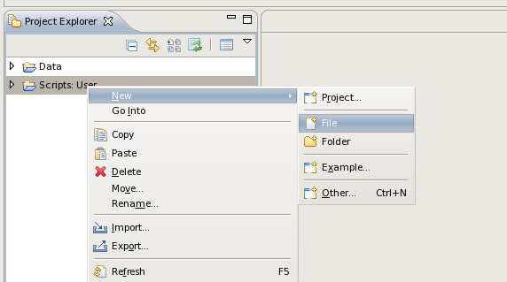
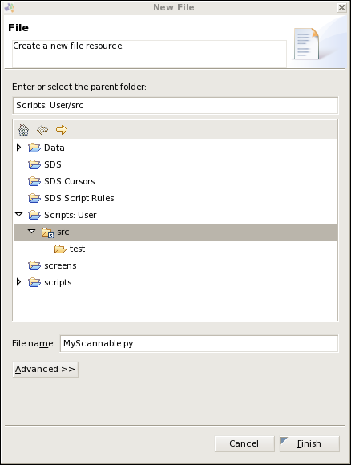
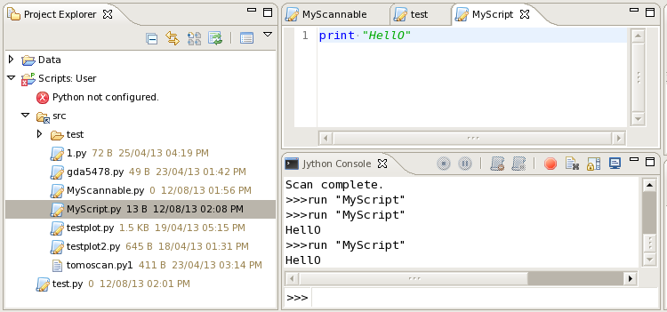
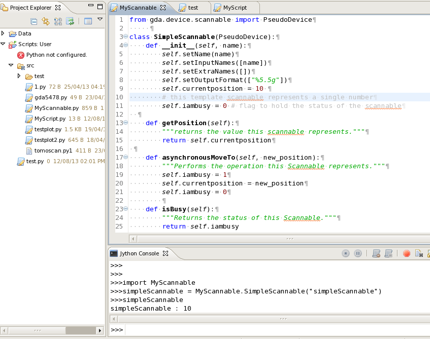

======================
Writing new scannables
======================

The definition of what a Scannable is has been designed to be as
flexible as possible. This is so that Scannables can represent as wide
a variety of concepts as possible - from pieces of hardware through to
complex calculations.

Simply put, a Scannable represents a number or an array of numbers and
acts in a manner analogous to a motor. In others words you can
retrieve the numbers the Scannable holds using the getPosition()
method, and you can have the Scannable perform some operation to
changes those numbers by using one of the move methods. You can also
ask the Scannables status to see if it ready to accept a call to one
of the move methods by using the isBusy() method.

Ways to interact with a scannable include:

.. function:: myScannable

   returns a pretty print version of the Scannable

.. function:: pos myScannable

   returns a pretty print version of the Scannable

.. function:: myScannable()

   returns the current position of the scannable

.. function:: pos myScannable 10

   moves the Scannable

.. function:: myScannable(10)

   alternative syntax to move the Scannable

.. function:: pos myScannable 10 myOtherScannable 20

   moves two scannables at the same time

.. function:: inc myScannable 1

   relative move of the Scannable

.. function:: myScannable.isBusy()

   returns True (1) if the Scannable is moving

.. function:: myScannable.waitWhileBusy()

   returns when the Scannable has finished moving

.. function:: myScannable.a(10)

   asynchronous move: instructs the Scannable to move and then returns
   immediately

.. function:: myScannable.ar(1)

   asynchronous relative move 

How to create a Scannable
=========================

Create a script file. Open the Scripts perspective. Within the Project Explorer view  expand the 'Scripts: User' folder to expose the
'src' child of this folder. Select the 'src' item, press the right mouse button and select New File. 

In the "New File" dialog enter the filename ( with extension .py) and press Finish. 
The new file will be created and will be displayed in the editor view ready for you to start adding content.

To run the script enter the use the run command, e.g. to run the code in the script file MyScript.py::

>run "MyScript.py"

If the script file contains the definition of a Scannable, i.e. class , then you do not run the script but rather
'import' it and then issue a command to create an instance of the object::

>import MyScannable.py

If you change the content of MyScannable you need to reload it::

>reload(MyScannable)

After importing the file you can instantiate an instance of the class defined in the file by executing its constructor, using the code shown below

::

> simpleScannable = MyScannable.SimpleScannable("simpleScannable")

Basic Template
==============

To write your own Scannable, you need to extend a base class which
provides most of the functionality required. You simple then need to
implement three methods relating to returning the position, performing
the operation and returning the status. A template for this most
simple case is shown below::

    from gda.device.scannable import PseudoDevice
    from gda.device.scannable import ScannableUtils
     
    class MyScannable(PseudoDevice):
        def __init__(self, name):
	    self.setName(name)
	    self.setInputNames([name])
	    self.setExtraNames([])
	    self.setOutputFormat(["%5.5g"])
	    self.currentposition = 10 # this template scannable represents a single number
	    self.iambusy = 0 # flag to hold the status of the scannable
  
        def getPosition(self):
	    """returns the value this scannable represents."""
	    return self.currentposition
 
        def asynchronousMoveTo(self, new_position):
	    """Performs the operation this Scannable represents."""
	    self.iambusy = 1
	    self.currentposition = new_position
	    self.iambusy = 0
        
        def isBusy(self):
	    """Returns the status of this Scannable."""
	    return self.iambusy
    					
Once these three methods have been implemented, the class can act like
any other Scannable and be used in scans and within the other commands
listed in this guide. The constructor is a bit more complex as it
needs to define what numbers the Scannable holds. It is explained in
more detail below.

The Scannable Constructor
=========================

The Scannable constructor shown in the basic template sets up the
Scannable for use::

    # constructor
    def __init__(self, name):
	self.setName(name)
	self.setInputNames([name])
	self.setExtraNames([])
	self.setOutputFormat(["%5.5g"])
	self.currentposition = 10 # this template scannable represents a single number
	self.iambusy = 0 # flag to hold the status of the scannable
    					

In this example The two last lines of this constructor sets the
Scannable's starting value and creates a flag which will determine its
busy status. These two attributes are specific to this class and are
used in the three methods which the class implements.

The other lines in the constructor are obligatory for the Scannable to
work properly and are designed to enable this class to interact
properly with the base class which this class extends (namely
PseudoDevice ).The first of these lines sets the Scannable's name.
This name is used when pretty-printing the class to the Jython
terminal. The other three lines set up three arrays which define what
numbers this Scannable represents, what they are called and what
format that should be printed out in when pretty-printing the
Scannable to the terminal::

    self.setInputNames([name])
    self.setExtraNames([])
    self.setOutputFormat(["%5.5g"])
    						
The InputNames array gives the size of the array that this Scannable's
rawAsynchronousMoveTo expects. Each element of the InputNames array is
a label for that element which is used in file headers etc. Note that
this array can be zero-sized if required.

The ExtraNames array is used in a similar manner to the InputNames
array, but lists additional elements in the array returned by the
Scannable's rawGetPosition method i.e. the array returned by
rawGetPosition may be larger than the array required by
rawAsynchronousMoveTo. This allows for the possibility that a
Scannable may hold and return more information than it needs in order
to move or perform whatever operation it does inside its
rawAsynchronousMoveTo method. This array would normally be zero-sized
if required.

The OutputFormat array lists the formatting strings for both the
elements of the InputNames and ExtraNames arrays. This is used when
pretty-printing the output from rawGetPosition. It is vital that the
size of the OutputFormat array is the same size as the sum of the
sizes of the InputNames and ExtraNames arrays for the Scannable to
work properly.

Methods available to implement in the Scannable Interface
=========================================================

There are a number of methods which may optionally be implemented in
Scannable classes to extend their functionality. Most of them are for
use during step scans in case you need extra operations outside of the
normal operation of repeatedly moving Scannables and collecting data.

.. function:: scannable.atPointStart()
   
	called immediately before moving any Scannables at every point
	in a step scan

.. function:: scannable.atPointEnd()

	called immediately after collecting data at every point in a
	step scan

.. function:: scannable.atScanLineStart()

	called at the start of every sub-scan in a multi-dimensional
	scan

.. function:: scannable.atScanLineEnd()

        called at the end of every sub-scan in a multi-dimensional
        scan

.. function:: scannable.atScanStart()

        called at the start of every scan

.. function:: scannable.atScanEnd()

        called at the end of every scan

.. function:: scannable.stop()

        called when aborting a scan or pressing the 'Panic Stop'
        button on the JythonTerminal. This should be used to enable
        aborting the operation being performed within the Scannable's
        rawAsynchronousMoveTo method.

.. function:: scannable.toString()

        string implement this to override the pretty-print output for
        this Scannable

.. function:: scannable.isPositionValid()

        given an object representing a position, this should return 1
        (true) if the position is acceptable to this Scannable

More templates
==============

Here are a number of more detailed templates, with annotation, which
may be helpful:

Full Scannable template
-----------------------

A fuller version of the basic template shown before:

.. sourcecode:: python

    
    	from gda.device.scannable import PseudoDevice
    
    	#
    	# A template for all Scannable classes.
    	#
    	# The rawIsBusy, rawGetPosition, and rawAsynchronousMoveTo methods must be
    	# implemented.
    	#
    	# The others (commented out here) are optional depending on how your scannable
    	# works.
    	#
    	#******************************************************************************
    	# Note: the inputNames, extraNames and outputFormat arrays defined in __init__:
    	# Your Scannable could represent no numbers, a single number or an array of
    	# numbers. These arrays define what the Scannable represents.
    	#
    	# The inputNames array is a list of labels of the elements accepted by the
    	# new_position argument of the rawAsynchronousMoveTo method.
    	#
    	# The extraNames array is a list of labels of extra elements in case the array
    	# returned by rawGetPosition is larger than the array accepted by
    	# rawAsynchronousMoveTo.
    	#
    	# The outputFormat array is used when pretty-printing the scannable and lists
    	# the format to use for each element in the array returned by rawGetPosition.
    	# It is very important that the size of this array matches the sum of the sizes
    	# of inputNames and extraNames.
    	#
    	#
    	#******************************************************************************
    	#
    	class scannableTemplate(PseudoDevice):
    
    	    #
    	    # The constructor.
    	    #
    	    def __init__(self, name):
    	       self.name = name
    	       self.currentposition = 10 # this scannable represents a single number
    	       self.setInputNames([name])
    	       self.setExtraNames([])
    	       self.setOutputFormat(["%5.5g"])
    	       self.iambusy = 0 # flag to hold the status of the scannable
    
    	    #
    	    # Returns the value represented by this Scannable. This should be a number
    	    # or an array of numbers
    	    #
    	    def rawGetPosition(self):
    	        return self.currentposition
    
    	    #
    	    # Does the work represented by this Scannable. If this takes a long time,
    	    # then you should run a separate thread from within this method. See the
    	    # threaded_scannable_template.py script for details on how to do this.
    	    #
    	    def rawAsynchronousMoveTo(self, new_position):
    	        self.iambusy = 1
    	        self.currentposition = new_position
    	        self.iambusy = 0
    
    	    #
    	    # Returns false (0) if the action started by rawAsynchronousMoveTo has been
    	    # completed
    	    #
    	    def rawIsBusy(self):
    	        return self.iambusy
    
    	    #
    	    # Called when panic stop called on the system.
    	    #
    	    # def stop(self): 
    	    #     print str(self.name), "stop called!"
    
    	    #
    	    # Implement this to override the pretty-print version of this Scannable
    	    #
    	    # def toString(self):
    	    #     return self.name
    
    	    #
    	    # Given an object, this returns true (1) if that object is a valid position
    	    # for this scannable to use in its rawAsynchronousMoveTo method
    	    #
    	    # def isPositionValid(self):
    	    #     return 1
    
    	    #
    	    # Called just before every node in a scan
    	    #
    	    # def atPointStart(self):
    	    #     print str(self.name),"doing atPointStart()!"
    
    	    #
    	    # Called after every node in a scan
    	    #
    	    # def atPointEnd(self):
    	    #     print str(self.name), "doing atPointEnd()!"
    
    	    #
    	    # In multi-dimensional scans, called before each line in the scan
    	    # This is still called once in single dimensional scans.
    	    #
    	    # def atScanLineStart(self):
    	    #     print str(self.name), "doing atScanStart()!"
    
    	    #
    	    # In multi-dimensional scans, called after each line in the scan
    	    # This is still called once in single dimensional scans.
    	    #
    	    # def atScanLineEnd(self):
    	    #     print str(self.name), "doing atScanEnd()!"
    
    	    #
    	    # Called at the start of the scan (called once in multi-dimensional scans)
    	    #
    	    # def atScanGroupStart(self):
    	    #     print str(self.name), "doing atGroupStart()!"
    
    	    #
    	    # Called at the end of the scan (called once in multi-dimensional scans)
    	    #
    	    # def atScanGroupEnd(self):
    	    #     print str(self.name), "doing atGroupEnd()!"
    					

Threaded Scannable Template
---------------------------

A Scannable whose operation inside rawAsynchronousMoveTo is run in a
separate thread:

.. sourcecode:: python

    
    	from gda.device.scannable import PseudoDevice
    	from java.lang import Thread, Runnable
    	    
    	#
    	# Threaded version of the class in scannable_template in case the work performed
    	# within the rawAsynchronousMoveTo takes a long time.
    	#
    	class threadedScannableTemplate(PseudoDevice):
    	    
    	    #
    	    # The constructor. 
    	    #
    	    def __init__(self, name):
    	        self.name = name
    	        self.currentposition = 10 # this scannable represents a single number
    	        self.setInputNames([name])
    	        self.setExtraNames([])
    	        self.setOutputFormat(["%5.5g"])
    	        self.iambusy = 0 # flag to hold the status of the scannable
    	    
    	    #
    	    # Returns the value represented by this Scannable. This should be a number
    	    # or an array of numbers
    	    #
    	    def rawGetPosition(self):
    	        return self.currentposition
    	    
    	    #
    	    # Creates a new moveScannableThread object to do the work and then starts it
    	    # in a new thread.
    	    #
    	    def rawAsynchronousMoveTo(self, new_position):
    	        self.iambusy = 1
    	        newThread = moveScannableThread(self, new_position)
    	        t = Thread(newThread)
    	        t.start()
    	    
    	    #
    	    # Returns false (0) if the action started by rawAsynchronousMoveTo has been 
    	    # completed
    	    #
    	    def rawIsBusy(self):
    	        return self.iambusy
    	    
    	    
    	#
    	# An object called internally by the threadedScannableTemplate.
    	#
    	# It is very important that the busy flag is set to 0 at the end of 
    	# the run method.
    	#
    	class moveScannableThread(Runnable):
    	    
    	    #
    	    # Constructor for this class
    	    #
    	    def __init__(self, theScannable, new_position):
    	        self.myScannable = theScannable
    	        self.target = new_position
    	    
    	    #
    	    # Does the work to move what the Scannable represents. This is run in a new 
    	    # thread started by the line in rawAsynchronousMoveTo: t.start()
    	    #
    	    def run(self):
    	        print "you have asked me to move to", str(self.target)
    	        self.myScannable.currentposition = self.target	
    	        self.myScannable.iambusy = 0
    						

Detector Template
-----------------

For an object which you wish to act like a Detector:

.. sourcecode:: python

    
    	from gda.device.detector import PseudoDevice
    	    
    	#
    	# A template class to use as a basis to create your own Detector objects.
    	#
    	# Detectors must work in the following manner:
    	#     - a call to collectData to collect some new data. Ideally this should be 
    	#       asynchronous (i.e. the function returns immediately and the work is done
    	#       in a new Thread). See threaded_detector_template.py for this.
    	#     - repeated calls to getStatus may be made by external classes to see if
    	#       data is still being collected.
    	#     - once getStatus returns false (0) then a call to readout maybe made by 
    	#       external classes to collect the data.
    	#
    	#
    	class templateDetectorClass(PseudoDevice):
    	    
    	    #
    	    # The constructor.
    	    #
    	    def __init__(self, name):
    	        self.setName(name)
    	        self.isCollecting = 0
    	        self.myData = 0
    	    
    	    #
    	    # Performs the work to collect some data. This method should not return the 
    	    # data, but instead keep the status field up to date.
    	    #
    	    def collectData(self):
    	        self.isCollecting = 1
    	        print "you have asked me to collect data!"
    	        self.myData += 1
    	        self.isCollecting = 0
    	    
    	    #
    	    # Returns true (1) if this object is busy collecting data
    	    #
    	    def getStatus(self):
    	        return self.isCollecting
    	    
    	    #
    	    # Returns the last data which was collected. This should only be called when 
    	    # getStatus returns false
    	    #
    	    def readout(self):
    	        return self.myData
    								

Threaded Detector Template
--------------------------

A threaded version of the Detector template:

.. sourcecode:: python

    
    	from java.lang import Thread, Runnable
    	from gda.device.detector import PseudoDevice
    	    
    	#
    	# A more complex template for detectors in which the work to perform the data
    	# collection is performed in its own thread.
    	#
    	#
    	#
    	class threadedTemplateDetectorClass(PseudoDevice):
    	    
    	    #
    	    # The constructor.
    	    #
    	    def __init__(self, name):
    	        self.setName(name)
    	        self.isCollecting = 0
    	        self.myData = 0
    	    
    	    #
    	    # Performs the work to collect some data. This method should not return the 
    	    # data, but instead keep the status field up to date.
    	    #
    	    def collectData(self):
    	        self.isCollecting = 1
    	        newThread = collectDataThread(self)
    	        t = Thread(newThread)
    	        t.start()
    	    
    	    #
    	    # Returns true (1) if this object is busy collecting data
    	    #
    	    def getStatus(self):
    	        return self.isCollecting
    	    
    	    #
    	    # Returns the last data which was collected. This should only be called when 
    	    # getStatus returns false
    	    #
    	    def readout(self):
    	        return self.myData;
    	    
    	#
    	# A method called internally by the threadedTemplateDetectorClass to collect 
    	# the data in a separate thread. 
    	#
    	# It is very important that the isCollecting flag is set to 0 at the end of 
    	# this method.
    	#
    	class collectDataThread(Runnable):
    	    
    	    def __init__(self, theDetector):
    	        self.myDetector = theDetector
    	    
    	    def run(self):
    	        print "you have asked me to collect data!"
    	        self.myDetector.myData +=1
    	        self.myDetector.isCollecting = 0
    						

Multi-Dimensional Scannable Template
------------------------------------

An example of how to write a Scannable which represents an array of
numbers, including more output from the position command than what is
received by the move method:

.. sourcecode:: python

    
    	from gda.device.scannable import PseudoDevice
    	    
    	class MultiElementTestClass(PseudoDevice):
    	    
    	    def __init__(self):
    	        self.setName("y")
    	        self.setInputNames(["first","second"])
    	        self.setExtraNames(["third"])
    	        self._position = [20,30]
    	        self.setOutputFormat(["%4.10f","%4.10f","%4.10f"])
    	    
    	    def rawGetPosition(self):
    	        return self._position + [10]
    	    
    	    def rawAsynchronousMoveTo(self,new_position):
    	        if len(new_position) == 2:
    	            self._position=new_position
    	    
    	    def rawIsBusy(self):
    	        return 0    						

